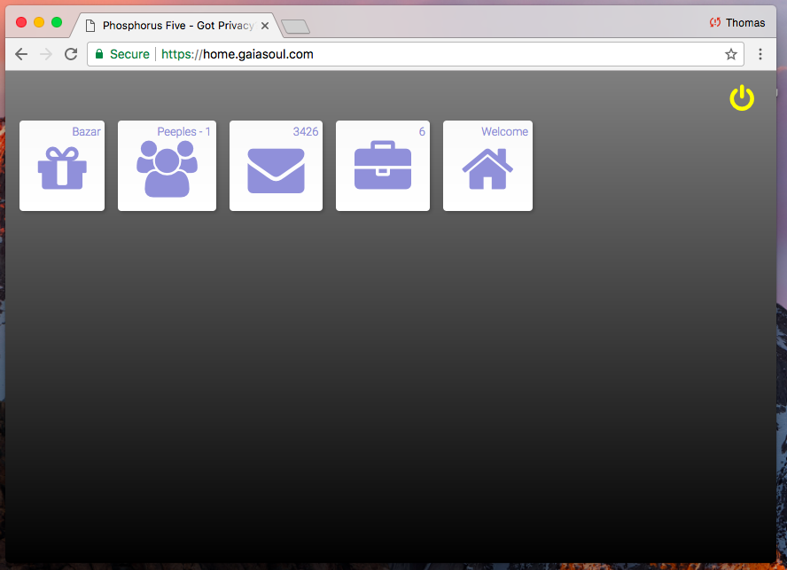
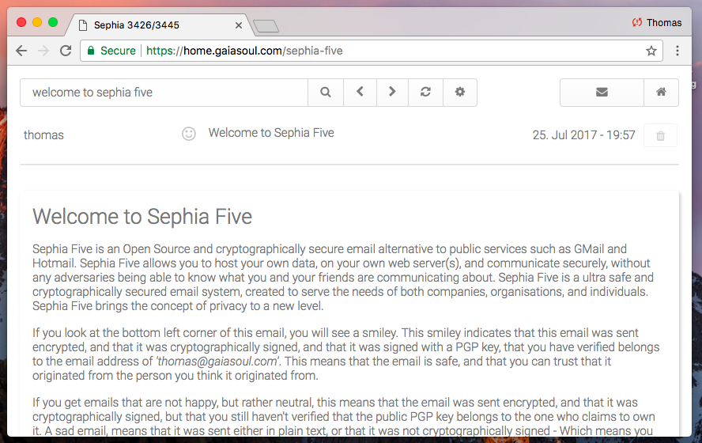
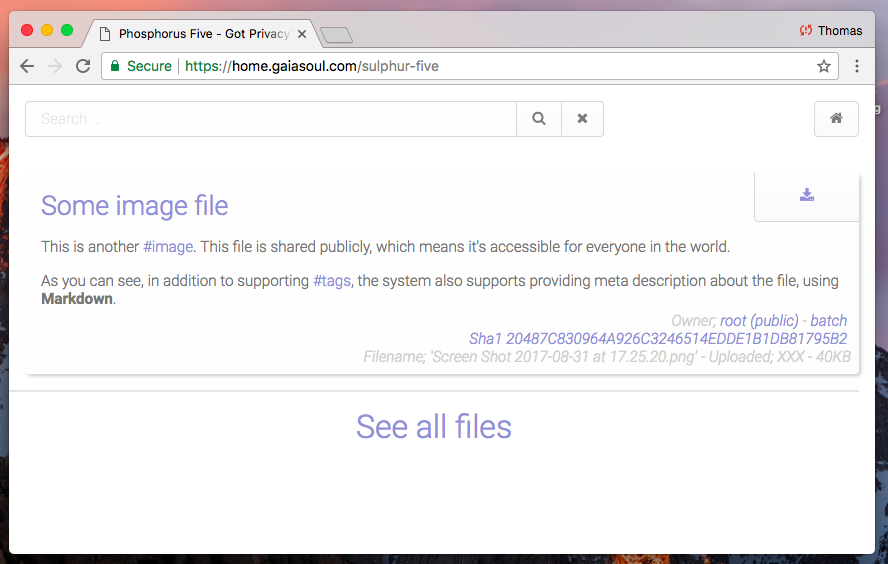
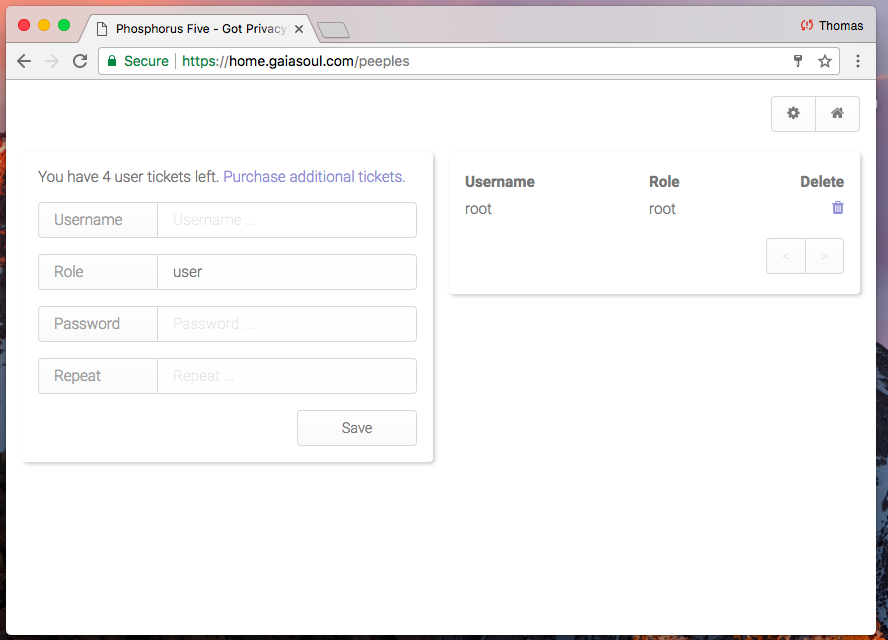
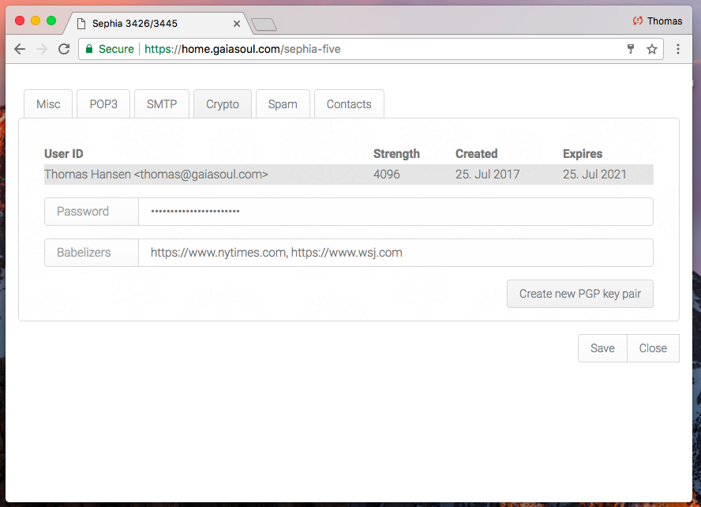

Phosphorus Five
===============

Phosphorus Five is a Web Operating System and a full stack Web Application Development Framework, for consuming and developing rich and highly 
interactive Ajax centric cryptographically secure web apps. It contains an entirely unique programming language called _"Hyperlambda"_, which 
allows you to orchestrate your apps together, almost as if they were made out of LEGO bricks. This facilitates for
an extremely modularised model of _"orchestrating"_ your applications together. Below is a screenshot of its _"desktop"_.



## Installation

To install the latest binary version of the system, run the following commands in a Linux/Ubuntu vanilla server terminal window, 
in order of appearance.

```
wget https://github.com/polterguy/phosphorusfive/releases/download/v4.8BETA/install.sh
chmod +x install.sh
sudo ./install.sh
```

When you're done with the above, visit the _"Bazar"_ through your browser, and fill up your system with whatever apps you want to install. Below are
screenshots of some of the more important apps you can fill up your system with. First [Sephia Five](https://github.com/polterguy/sephia-five),
which is a military grade PGP cryptographically secured webmail client.



Then a screenshot of a secure file sharing system, called [Sulphur Five](https://github.com/polterguy/sulphur-five).



Below is the [Peeples](https://github.com/polterguy/peeples) module, which allows you to manage users in your system.



The framework, and its apps, are built with the _"mobile first"_ approach, and renders responsively on every device you have. When you start
Phosphorus Five for the first time, you will be asked for a _"server salt"_ and a _"root"_ password. The system is initially installed completely
empty, which allows you to decide which apps you want to install on top of it, after you have started it. Installing apps is done through the _"Bazar"_,
and the process is cryptographically secured, by demanding apps to be cryptographically signed, with a private PGP key, belonging to the app
developer. By default, only apps developed by T.H. Rose Home Cloud, or more explicitly _me_ that is, are allowed to be installed into your system.
But this is easily modified by adding up a reference to your own private PGP key's fingerprint.

## Downloading the source for the system

To download the source code for the system, go to [Releases](https://github.com/polterguy/phosphorusfive/releases), download
the latest source code for Phosphorus Five, and then download e.g. [Sephia Five](https://github.com/polterguy/sephia-five), and/or
[Sulphur Five](https://github.com/polterguy/sulphur-five), and put the unzipped folders into your _"core/p5.webapp/modules/"_ folder.
In addition, you will have to also download [Micro](https://github.com/polterguy/micro), and put the unzipped folder into your _"/modules/"_ folder.
You would probably want to make sure your folders are called _"sephia-five"_, _"sulphur-five"_ and _"micro"_ as you put these modules into
your _"/modules/"_ folder. By default, GitHub adds versioning number to the folders when you create a release, and this is highly likely
not something you'd like to keep in your own folder structure, as you download the code for P5.

Having Micro in your _"modules"_ folder is **crucial** - Since most other modules depends upon Micro being installed. Other modules are
optional. Any module you build yourself, must be put into the _"/core/p5.webapp/modules/"_ folder of your installation.

When you have downloaded the source code, simply open Visual Studio, Xamarin or MonoDevelop, and browse for the _"p5.sln"_ file inside
if your Phosphorus Five source code folder, and open up this solution.

## Creating your own apps

Phosphorus Five is created in C#, but relies upon _"Hyperlambda"_, which is a modularised web application programming language, for
creating highly modularised components, seemlessly integrating these together, to create a uniform whole. An example of some 
Hyperlambda can be found below.

```
create-widget:foo
  element:button
  innerValue:Click me!
  onclick
    set-widget-property:foo
      innerValue:I was clicked!
```

Notice, the primary starting ground for learning how to code in Phosphorus Five can be found [here](https://github.com/polterguy/phosphorusfive-dox).
In addition, the reference documentation can be found as specific README files for each project. To see the documentation for P5, please
refer to these links.

* [Main documentation](https://github.com/polterguy/phosphorusfive-dox), tutorial style dox
* [core](core/), reference documentation
* [plugins](plugins/), reference documentation
* [modules](core/p5.webapp/modules/), how the modularized parts of Phosphorus Five works
* [The Bazar](core/p5.webapp/modules/bazar/), the integrated _"AppStore"_ that comes with P5 out of the box

I recommend you start out with ["the guide"](https://github.com/polterguy/phosphorusfive-dox), for then to refer back to the reference documentation
for the [plugins](plugins/), as the need surface. Most of the examples in the core and plugin documentation, assumes you are 
using [System42](https://github.com/polterguy/system42), and either its Executor or CMS apps.

Notice, Phosphorus Five comes with an integrated _"AppStore"_ out of the box, which allows you to create your own Bazars, where you distribute
your apps and components, either for a fee, or as open source projects. This approach, makes it extremely modularized, allowing you to incrementally
create your systems, allowing its users to automatically choose to upgrade theirs, as you create new versions of your projects, or create additional
app, and/or components.

Please refer to [the Bazar](core/p5.webapp/modules/bazar/) to see how this part of P5 works. However, everything is open source, and you can
actually host your Bazar, without any other requirements but being able to publicly distribute a simple Hyperlambda file, on some web server somewhere.
This parts of P5 is also extremely secure, only allowing installations of modules that have been cryptographically signed, with a trusted PGP key.
Making it very hard for a malicious adversary to being able to execute malicious code on your user's servers. The Bazar is highly configurable,
and you can easily create your own repository of apps, and distribute yourself, using the Bazar. The Bazar features automatic PayPal integration,
if you'd like to provide apps in your Bazar for a fee.

## Hyperlambda

The code further up in this page, is called _"Hyperlambda"_, and is a simple key/value/children tree-structure, allowing for you
to declare something, that P5 refers to as _"lambda"_ or _"Hyperlambda"_. Lambda is the foundation for an execution tree, or graph object,
that is a Turing complete opportunity to declare your apps, through a _"non-programming model"_.

I say _"non-programming"_, because really, there is no programming language in P5. Only a bunch of loosely
coupled Active Events, that happens to, in their combined result, create a Turing complete execution
engine, allowing for you to orchestrate your components together, as if they were _"LEGO bricks"_. All this, while retaining your ability 
to create C#/VB/F# code, exactly as you're used to from before.

In fact, if you wish, you could in theory declare your execution trees by using XML or JSON. Although I recommend
using Hyperlambda, due to its much more condens syntax, and lack of overhead.
This trait of Hyperlambda, makes it an excellent choice for creating your own domain specific programming languages. In such a regard, it arguably
brings LISP into the 21st Century. However, don't be fooled by its simplicity. It's extremely powerful and secure. Below is a screenshot 
of Sephia Five's settings, that are entirely built in Hyperlambda.



Sephia Five is a military grade webmail client, with PGP cryptography, extreme security, and some very unique usability traits. Sephia Five
is the _"reference implemantation"_ for an example application built with Phosphorus Five. Sephia Five is also open source, and can be 
found [here](https://github.com/polterguy/sephia-five).

## 3 basic innovations

Phosphorus Five consists of three basic innovations.

* Managed Ajax
* Active Events
* Hyperlambda

The Ajax library is created on top of ASP.NET's Web Forms, allowing you to use them the same way you would create a web forms website.
Simply inject them declaratively into your markup, and change their properties and attributes in your codebehind. We say _"managed"_, because
it takes care of all state, Ajax serialization, and dynamic JavaScript inclusion automatically. In fact, when you use the Ajax library, you can
create your web apps, the same way you would normally create a desktop application. The Ajax library is extremely extendible, allowing you to create
your own markup, exactly as you wish. This is because there fundamentally exists only one single Ajax widget in the library, which allows for you to
declare its HTML tag, attributes, dynamically remove and change any parts of your DOM element, also during Ajax callbacks.

Active Events allows you to loosely couple your modules together, without having any dependencies between them. Active Events is the _"heart"_ of
Phosphorus Five, allowing for the rich plugin nature in P5. You can easily create your own Active Events, either in Hyperlambda, or in C# if you wish.

Hyperlambda, and lambda, is the natural bi-product of Active Events; A Turing complete execution engine, for orchestrating your apps 
together, as shown above in the Hello World example.

## Perfect encapsulation and polymorphism

The 3 USPs mentioned above, facilitates for a development model, which allows you to combine your existing C# skills,
creating plugins, where you can assemble your apps, in a loosely coupled architecture. This is in stark
contrast to the traditional way of _"carving out"_ apps, using interfaces for plugins, which often creates a much higher degree of
dependencies between your app's different components.

The paradox is, that due to neither using OOP nor inheritance, in any ways, Hyperlambda facilitates for perfect encapsulation, and polymorphism,
without even as much as a trace of classic inheritance, OOP or types. Hyperlambda is a _"functional programming language"_ on top of the CLR,
making the act of orchestrating CLR modules, loosely coupled together, in a super-dynamic environment, as simple as a walk in the park.

## C# samples

For those only interested in using e.g. the Ajax library, and/or the Active Event implementation, there are some examples of this in 
the [samples folder](/samples/).

## Getting started

The easiest way to getting started using P5, is to use it in combination with [System42](https://github.com/polterguy/system42).
This gives you an intellisense environment for your Active Events, and provides a lot of developer tools, in addition to a bunch
of really cool extension widgets. All this in a _"non-CMS environment"_, which means you can create small apps, almost the same way you'd
create a CMS web page.

If you take this approach, which I recommend for beginners - Make sure you put the _"system42"_ folder inside of 
your _"/phosphorusfive/core/p5.webapp/modules/"_ folder, and make sure its name is exactly _"system42"_, without any versioning numbers, 
etc. Then restart your web server process, and have fun!

After you've played around with System42 for some time, understanding the development model, you can go more hard-core into it, ditch System42,
and create your own apps, entirely from scratch if you wish. The latter approach is what I recommend for building real apps, which you intend
to distribute, and use in real live production sites.

Notice, regardless of which approach you take when you start out - You must make sure the _"/core/p5.webapp"_ project is your startup project, unless
you intend to evaluate Hyperlambda in a terminal window, using the lambda.exe project.

## More dox

Some of the folders inside of P5 have specific documentation for that particular module or folder. Feel free to start reading up at e.g.

* [plugins](plugins/)
* [core](core/)

Below is an extensive list of the documentation to all plugins in the core, in on single list, for your convenience. But there might also exist
other P5 components out there, in addition to that it is extremely easy to [roll your own plugin](/samples/p5.active-event-sample-plugin), 
if you know some C# from before.

* [p5.config](/plugins/p5.config) - Accessing your app's configuration settings
* [p5.data](/plugins/p5.data) - A super fast memory based database
* [p5.events](/plugins/p5.events) - Creating custom Active Events from Hyperlambda
* [p5.hyperlambda](/plugins/p5.hyperlambda) - The Hyperlambda parser
* [p5.io](/plugins/p5.io) - File input and output, in addition to folder management
* [p5.lambda](/plugins/p5.lambda) - The core "keywords" in P5
* [p5.math](/plugins/p5.math) - Math Active Events
* [p5.strings](/plugins/p5.strings) - String manipulation in P5
* [p5.types](/plugins/p5.types) - The types supported by P5
* [p5.web](/plugins/p5.web) - Everything related to web (Ajax widgets among other things)
* [p5.auth](/plugins/extras/p5.auth) - User and role management
* [p5.crypto](/plugins/extras/p5.crypto) - Some of the cryptography features of P5, other parts of the cryptography features can be found in p5.mime and p5.io.zip
* [p5.csv](/plugins/extras/p5.csv) - Handling CSV files in P5
* [p5.flickr](/plugins/extras/p5.flickrnet) - Searching for images on Flickr
* [p5.html](/plugins/extras/p5.html) - Parsing and creating HTML in P5
* [p5.http](/plugins/extras/p5.http) - HTTP REST support in P5
* [p5.imaging](/plugins/extras/p5.imaging) - Managing and manipulating images from P5
* [p5.authorization](/plugins/extras/p5.io.authorization) - Authorization features in P5
* [p5.io.zip](/plugins/extras/p5.io.zip) - Zip'ing and unzip'ing files, also supports AES cryptography
* [p5.mail](/plugins/extras/p5.mail) - Complex and rich SMTP and POP3 support, which is far better than the internal .Net classes for accomplishing the same
* [p5.mime](/plugins/extras/p5.mime) - MIME support, in addition to PGP, and handling your GnuPG database
* [p5.mysql](/plugins/extras/p5.mysql) - MySQL data adapter
* [p5.threading](/plugins/extras/p5.threading) - Threading support in P5
* [p5.xml](/plugins/extras/p5.xml) - XML support in P5
* [p5.markdown](/plugins/extras/p5.markdown) - Parsing Markdown snippets
* [p5.json](/plugins/extras/p5.json) - Parsing and creating JSON. __NOT YET RELEASED!!__

P5 have also been published twice in Microsoft's MSDN Magazine. Read the articles below written by yours truly.

* [Active Events: One design pattern instead of a dozen](https://msdn.microsoft.com/en-us/magazine/mt795187)
* [Make C# more dynamic with Hyperlambda](https://msdn.microsoft.com/en-us/magazine/mt809119)

If you wish to read these articles, you should probably read them sequentially, to make sure you understand Active Events, 
before you dive into Hyperlambda.

## License

Phosphorus Five is free and open source software, and licensed under the terms
of the Gnu Public License, version 3, in addition to that commercially license are available for a fee. Read more about
our Quid Pro Quo license terms at [my website](https://gaiasoul.com/license/).

## More information

I occasionally blog about P5, when I do, I do so [here](https://gaiasoul.com).

There exists a [code of conduct](CODE_OF_CONDUCT.md) for the project you should read if you wish to participate 
in the project. But basically what it says, is _"be nice"_ and preferably if you can, _"apply humor"_.

I have also deployed Phosphorus Five on my own personal home cloud, which is actually just an old discarded Windows laptop,
which I have upgraded to become a Linux/Ubuntu/Phosphorus Five web server. If you'd like to test it, feel free 
to [vist it here](https://home.gaiasoul.com) - However, be warned, I am running this thing out of my living room, on an old
discarded laptop, with a plain average internet connection.

## Hire me

Need more training or personal assistance in regards to Phosphorus Five, don't hesitate to pass me an email.

Thomas Hansen; thomas@gaiasoul.com

There also exists a [commercial license](https://gaiasoul.com/license/) for those who cannot use the GPL license for some reasons.
