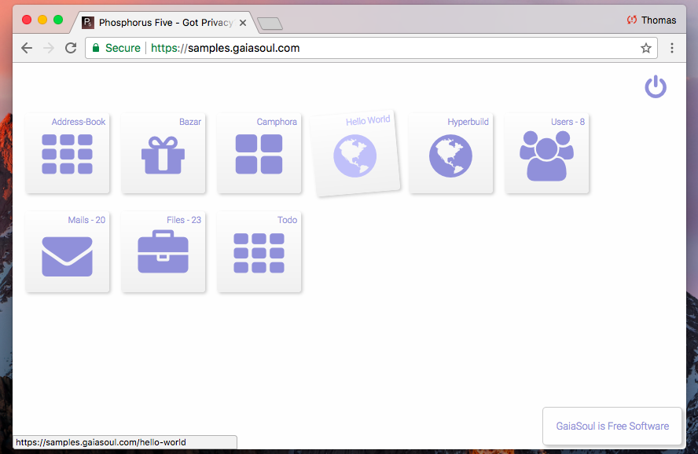

Phosphorus Five - A Web Operating System
===============

Phosphorus Five is a Web Operating System and a full stack Web Application Development Framework, for consuming and developing rich and highly 
interactive and secure web apps. It contains an entirely unique programming language called _"Hyperlambda"_, which 
allows you to orchestrate your apps together, almost as if they were made out of LEGO bricks.



## Installation

[Read about installation here](https://github.com/polterguy/phosphorusfive/releases). Basically, it allows you to install it either locally,
running its code version through e.g. Visual Studio, or installing the binary release on for instance a Linux/Ubuntu server.
The default source installation has no dependencies besides .Net/Mono, unless you want to install additional _"apps"_ through its Bazar.

## Creating your own apps

Phosphorus Five is created in C#, but relies upon _"Hyperlambda"_. Hyperlambda is a modularised web application programming language, for
creating highly modularised components. Hyperlambda allows you to seemlessly integrate your modules together, and _"orchestrate"_ building blocks -
Similarly to how you would create things out of LEGO. An example of some Hyperlambda can be found below.

```
create-widget:foo
  element:button
  innerValue:Click me!
  onclick
    set-widget-property:foo
      innerValue:I was clicked!
```

Notice, the primary starting ground for learning how to code in Phosphorus Five can be found [here](https://github.com/polterguy/phosphorusfive-dox).
In addition, the reference documentation can be found as specific README files for each project. To see the documentation for P5, please
refer to these links.

* [Main documentation](https://github.com/polterguy/phosphorusfive-dox), tutorial style dox
* [core](core/), reference documentation
* [plugins](plugins/), reference documentation
* [modules](core/p5.webapp/modules/), how the modularized parts of Phosphorus Five works
* [The Bazar](core/p5.webapp/modules/bazar/), the integrated _"AppStore"_ that comes with P5 out of the box

## 3 basic innovations

Phosphorus Five consists of three basic innovations.

* Managed Ajax
* Active Events
* Hyperlambda

The Ajax library is created on top of ASP.NET's Web Forms, allowing you to use them the same way you would create a web forms website.
Simply inject them declaratively into your markup, and change their properties and attributes in your codebehind. We say _"managed"_, because
it takes care of all state, Ajax serialization, and dynamic JavaScript inclusion automatically. In fact, when you use the Ajax library, you can
create your web apps, the same way you would normally create a desktop application. The Ajax library is extremely extendible, allowing you to create
your own markup, exactly as you wish. This is because there fundamentally exists only one single Ajax widget in the library. This approach allows 
you to declare your HTML tags, attributes, dynamically remove and change any parts of your DOM element, also during Ajax callbacks.

Active Events allows you to loosely couple your modules together, without having any dependencies between them. Active Events is the _"heart"_ of
Phosphorus Five, allowing for the rich plugin nature in P5. You can easily create your own Active Events, either in Hyperlambda, or in C# if you wish.
You can read an MSDN article about Active Events [here](https://msdn.microsoft.com/en-us/magazine/mt795187).

Hyperlambda, and lambda, is the natural bi-product of Active Events; A Turing complete execution engine, for orchestrating your apps 
together, as shown above in the Hello World example. By combining Active Events together with Managed Ajax and Hyperlambda - Your apps truly
_"comes alive"_, and creating rich web apps, becomes ridiculously easy. You can read an MSDN article about 
Hyperlambda [here](https://msdn.microsoft.com/en-us/magazine/mt809119).

### C#, a dynamic programming language!

These three innovations combined, makes C# become a _"dynamic"_ programming language. In fact, much more dynamic than any other dynamic programming
languages you have ever used.

## Encapsulation and polymorphism without OOP

The 3 USPs mentioned above, facilitates for a development model, which allows you to combine your existing C# skills,
creating plugins, where you can assemble your apps, in a loosely coupled architecture. This is in stark
contrast to the traditional way of _"carving out"_ apps, using strongly and statically typed interfaces for plugins, which often creates a 
much higher degree of dependencies between your app's different components.

The paradox is, that due to neither using OOP nor inheritance or types, in any ways, Hyperlambda facilitates for arguably perfect encapsulation 
and polymorphism, without even as much as a trace of classic inheritance, OOP, or types. Hyperlambda is a _"functional programming language"_ on 
top of the CLR, making the act of orchestrating CLR modules, loosely coupled together, in a highly dynamic environment, easily achieved.

## C# samples

For those only interested in using e.g. the Ajax library, and/or the Active Event implementation, there are some examples of this in 
the [samples folder](/samples/).

## More dox

Some of the folders inside of P5 have specific documentation for that particular module or folder. Feel free to start reading up at e.g.

* [plugins](plugins/)
* [core](core/)

Below is an extensive list of the documentation to all plugins in the core, in on single list, for your convenience. But there might also exist
other P5 components out there, in addition to that it is extremely easy to [roll your own plugin](/samples/p5.active-event-sample-plugin), 
if you know some C# from before.

* [p5.config](/plugins/p5.config) - Accessing your app's configuration settings
* [p5.data](/plugins/p5.data) - A super fast memory based database
* [p5.events](/plugins/p5.events) - Creating custom Active Events from Hyperlambda
* [p5.hyperlambda](/plugins/p5.hyperlambda) - The Hyperlambda parser
* [p5.io](/plugins/p5.io) - File input and output, in addition to folder management
* [p5.lambda](/plugins/p5.lambda) - The core "keywords" in P5
* [p5.math](/plugins/p5.math) - Math Active Events
* [p5.strings](/plugins/p5.strings) - String manipulation in P5
* [p5.types](/plugins/p5.types) - The types supported by P5
* [p5.web](/plugins/p5.web) - Everything related to web (Ajax widgets among other things)
* [p5.auth](/plugins/extras/p5.auth) - User and role management
* [p5.crypto](/plugins/extras/p5.crypto) - Some of the cryptography features of P5, other parts of the cryptography features can be found in p5.mime and p5.io.zip
* [p5.csv](/plugins/extras/p5.csv) - Handling CSV files in P5
* [p5.flickr](/plugins/extras/p5.flickrnet) - Searching for images on Flickr
* [p5.html](/plugins/extras/p5.html) - Parsing and creating HTML in P5
* [p5.http](/plugins/extras/p5.http) - HTTP REST support in P5
* [p5.imaging](/plugins/extras/p5.imaging) - Managing and manipulating images from P5
* [p5.authorization](/plugins/extras/p5.io.authorization) - Authorization features in P5
* [p5.io.zip](/plugins/extras/p5.io.zip) - Zip'ing and unzip'ing files, also supports AES cryptography
* [p5.mail](/plugins/extras/p5.mail) - Complex and rich SMTP and POP3 support, which is far better than the internal .Net classes for accomplishing the same
* [p5.mime](/plugins/extras/p5.mime) - MIME support, in addition to PGP, and handling your GnuPG database
* [p5.mysql](/plugins/extras/p5.mysql) - MySQL data adapter
* [p5.threading](/plugins/extras/p5.threading) - Threading support in P5
* [p5.xml](/plugins/extras/p5.xml) - XML support in P5
* [p5.markdown](/plugins/extras/p5.markdown) - Parsing Markdown snippets
* [p5.json](/plugins/extras/p5.json) - Parsing and creating JSON. __NOT YET RELEASED!!__

## MSDN Magazine articles

P5 have been published three times in Microsoft's MSDN Magazine. Read the articles below written by yours truly.

1. [Active Events: One design pattern instead of a dozen](https://msdn.microsoft.com/en-us/magazine/mt795187)
2. [Make C# more dynamic with Hyperlambda](https://msdn.microsoft.com/en-us/magazine/mt809119)
3. [Could Managed AJAX Put Your Web Apps in the Fast Lane](https://msdn.microsoft.com/en-us/magazine/mt826343)

If you wish to read these articles, you might benefit from reading them sequentially, to make sure you understand Active Events, 
before you dive into Hyperlambda.

## License

Phosphorus Five is free and open source software, and licensed under the terms
of the Gnu Public License, version 3, in addition to that commercially license are available for a fee. Read more about
our Quid Pro Quo license terms at [my website](https://gaiasoul.com/license/).
