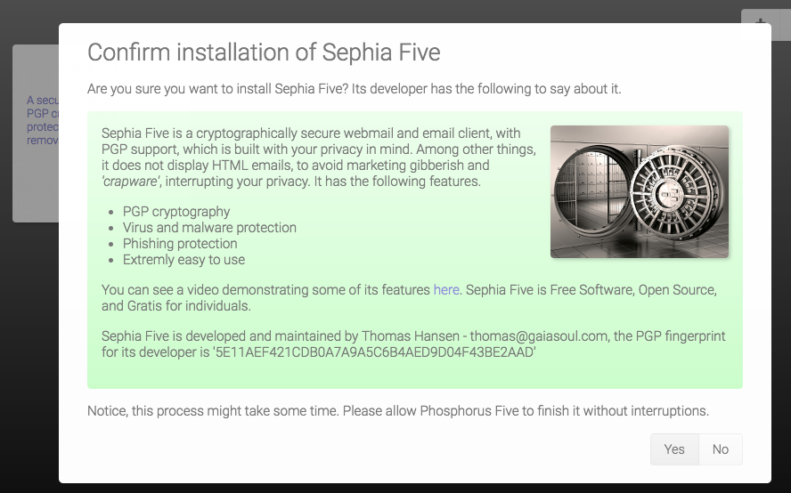

The Bazar
========

This folder contains everything related to the Bazar. If you do not want to have your users access the Bazar, you can simply
delete the entire folder, at which point the entirety of the Bazar will be removed from the system. The Bazar will look like
the following on your system when you install a new app.

The Bazar will only install apps that have been cryptographically signed with a PGP key, who's fingerprint can be found
in the _"/configuration/trusted-app-distributors.hl"_ file. Files you distribute in your Bazar, must hence be cryptographically
signed zip files, which you can do by for instance using the **[p5.mime.save]** Active Event.

A user can however add a new Bazar to his list of Bazars, which will add the Bazar's URL to the _"/configuration/bazars.hl"_ file,
which will traverse the bazar declaration file, for all of its trusted app distributors' fingerprints, and ask the user to
confirm that he wants to trust the fingerprint, to allow a new developer and/or distributor to install apps in his system.

You can also of course distribute P5 out of the box with your own fingerprint, and your own Bazar declaration(s). To create
your own Bazar file, see the _"/bazar/apps.hl"_ file, which is the default Bazar in P5.
