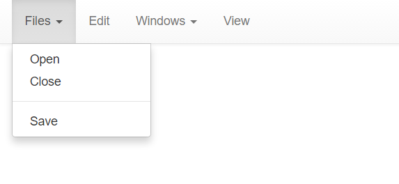
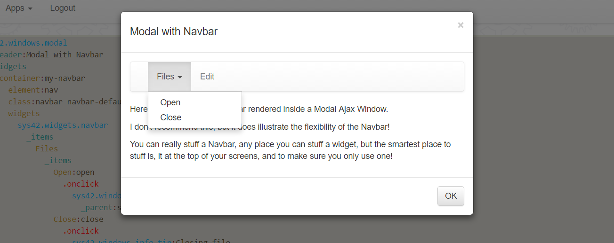
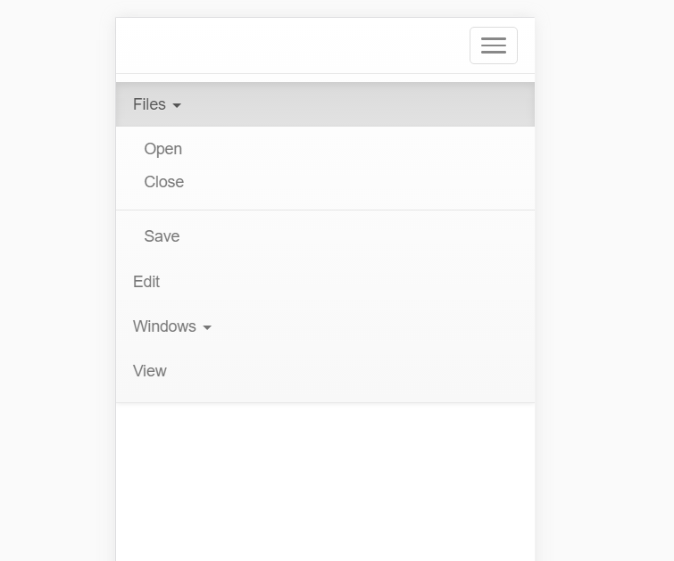

The Bootstrap Ajax Navbar widget
========

This folder contains the Bootstrap Ajax Navbar widget, that allows you to create an Ajax menu, to allow your users to navigate your app.
Even though the widget is 100% Ajax based, it still allows you to create a navigation menu, where the items are visible to search engines.
Items can also be bookmarked.

To use it, add it to a container widget collection, through its widget creational Active Event *[sys42.widgets.navbar]*. Example below.

```
/*
 * Notice, the appearance of the Navbar is actually controlled by the
 * parent widget's CSS class. In addition, you should also make sure
 * you create its parent widget as a 'nav' HTML element, to ensure the
 * correct semantics for your Navbar.
 */
p5.web.widgets.create-container:my-navbar
  position:0
  parent:cnt
  element:nav
  class:navbar navbar-default navbar-fixed-top
  widgets

    // Notice, no [_class] property on Navbar, see above comment.
    sys42.widgets.navbar

      // Setting the navbar into "SEO"/crawler-friendly mode.
      crawl:true

      // These are the root menu items.
      items
        Files

          // Any root item with its own [_items] collection, will
          // have children menu items of its own.
          items
            Open:open
              .onclick
                sys42.windows.info-tip:You tried to open a file
            Close:close
              .onclick
                sys42.windows.info-tip:Closing file

            // If you add a menu item with the name of [_separator], it will
            // create a horizonat separator between your items.
            _separator

            // This one is shown after the separator.
            Save:save
              .onclick
                sys42.windows.info-tip:And we're going to save ...

        Edit:edit
          .onclick
            sys42.windows.info-tip:Edit was clicked
        Windows
          items
            First Window:first-window
              .onclick
                sys42.windows.info-tip:First window clicked
            Second Window:second-window
              .onclick
                sys42.windows.info-tip:Second window clicked
        View:view
          .onclick
            sys42.windows.info-tip:View was clicked
```

The above code will produce something like the following.



Notice, if you create the above Hyperlambda as a lambda page in your CMS, you must make sure you use a template without a navbar menu. Otherwise,
the two menus will be rendered at the same position, and only one of them will be visible. The _"no-navbar-menu"_ template for instance, is perfect.

Notice also, that you actually control the Navbar's appearance on the CSS classes you use for its parent widget. The Navbar itself, actually has 
no *[_class]* property. The above Hyperlambda for instance, creates a Navbar attached to the top of your screen. If you wish to attach it to the 
bottom of your screen for instance, you could use something like the following.

```
p5.web.widgets.create-container:my-navbar
  position:0
  parent:cnt
  element:nav
  class:navbar navbar-default navbar-fixed-bottom

  /* ... the rest of your code goes here ... */
```

## Ninja tricks

Since the Navbar is just another widget, you can actually stuff it anywhere you wish. Although, I do definitely not recommend this, you could for instance
put a Navbar inside your Modal Windows. Below is an example of such a thing.

```
sys42.windows.modal
  header:Modal with Navbar
  widgets
    container:my-navbar
      element:nav
      class:navbar navbar-default
      widgets
        sys42.widgets.navbar
          items
            Files
              items
                Open:open
                  .onclick
                    sys42.windows.info-tip:You tried to open a file
                      _parent:sys42-windows-modal-body-wrapper
                Close:close
                  .onclick
                    sys42.windows.info-tip:Closing file
                      _parent:sys42-windows-modal-body-wrapper
            Edit:edit
              .onclick
                sys42.windows.info-tip:Edit was clicked
                  _parent:sys42-windows-modal-body-wrapper
    literal
      element:p
      innerValue:Here is an example of a Navbar rendered inside a Modal Ajax Window.
    literal
      element:p
      innerValue:I don't recommend this, but it does illustrate the flexibility of the Navbar!
    literal
      element:p
      innerValue:@"You can really stuff a Navbar, any place you can stuff a widget, 
but the smartest place to stuff is, it at the top of your screens, and to make sure you only use one!"
```

The above Hyperlambda will result in something like the following.



## Responsive rendering

The Navbar is created with Bootstrap's responsive rendering at its heart. This means that it will also work 100% perfectly on devices
with smaller screens, such as phones for instance. Below is a screenshot of how the above Ajax Navbar will look like on an iPhone 6.



The menu will automatically "re-arrange" itself, and become a responsive popdown menu, if the screen resolution is smaller than some specific
threshold. This allows it to render on smaller devices, without ending up adding vertical scrolling constraints.

