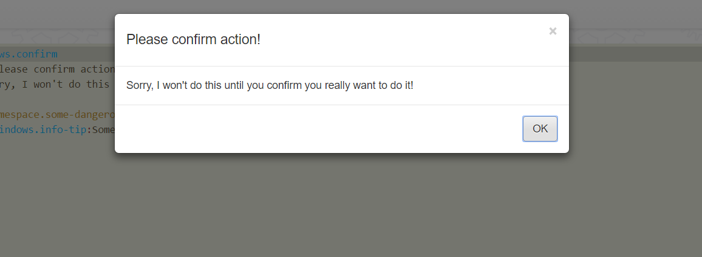
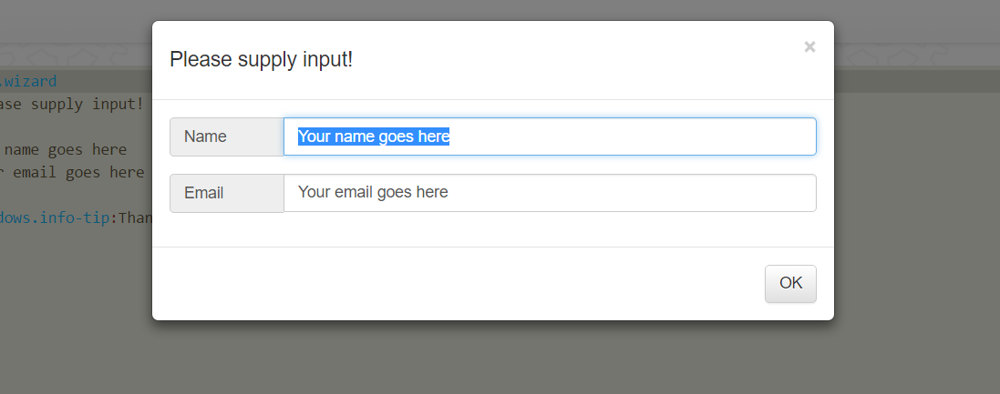
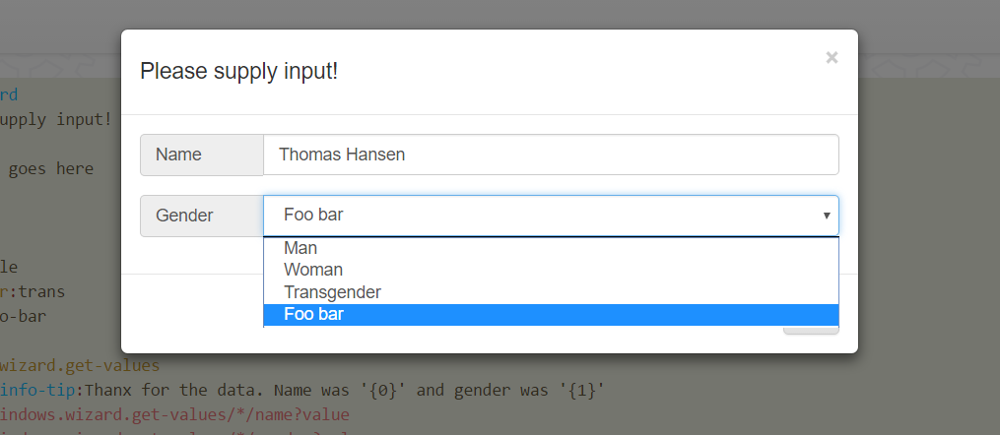

Bootstrap Modal Ajax Windows
===============

This folder contains the most commonly used Bootstrap modal windows, allowing for most common scenarios when you need to
display modal windows to your users. There are three basic windows, which are incrementally built on top of each other. The "base" window
used, is always *[sys42.windows.modal]*, which is the window the others are built upon.

* [sys42.windows.confirm] - The most basic window, allowing for user to confirm some action.
* [sys42.windows.wizard] - Automatically creates widgets from its [data] segment for you.
* [sys42.windows.modal] - Advanced version, allows you to inject any custom widgets into its modal body.


## [sys42.windows.confirm] - A modal confirmation window

This Active Event, creates a modal confirmation window, which by default simply contains a simple "OK" button, which once clicked,
can (optionally) evaluate some piece of lambda, declared through its *[.onok]* lambda callback. An example is show below.

```
sys42.windows.confirm
  header:Please confirm action!
  body:Sorry, I won't do this until you confirm you really want to do it!
  .onok
    sys42.windows.info-tip:Something dangerous just happened!!
```

The above code, will display the following.



Your *[.onok]* lambda callback, will only be evaluated if the user clicks the "OK" button. If he closes the window, by for instance
clicking the "X", or clicking outside of the modal window's main surface, then the window will simply close, without evaluating
the associated *[.onok]* lambda callback.

In addition to an *[.onok]* lambda callback, you can also supply an *[.oncancel]* lambda callback, which will evaluate only if the window
is closed _without_ the user clicking the "OK" button. Below is en example showing this. Try to close the window, both by clicking
the "OK" button, and by clicking the "X" in the top right corner, and watch the difference.

```
sys42.windows.confirm
  header:Please confirm action!
  body:Sorry, I won't do this until you confirm you really want to do it!
  .onok
    sys42.windows.info-tip:Something dangerous just happened!!
  .oncancel
    sys42.windows.info-tip:Puuh, you just avoided the dangerous stuff!!
```

Your *[.oncancel]* lambda callback will also evaluate if the user clicks anywhere outside of the modal window.

### Customizing your buttons

In addition to simply using the default "OK" button, you can also supply your own collection of buttons, that will be used instead
of the "OK" button. This is done by adding any buttons you wish inside a *[_buttons]* argument. Consider the following.

```
sys42.windows.confirm
  header:Please confirm action!
  body:Sorry, I won't do this until you confirm you really want to do it!
  buttons
    button
      class:btn btn-default
      innerValue:Yup
      oninit
        sys42.windows.modal.initial-focus:x:/../*/_event?value
      onclick
        sys42.windows.modal.ok
    button
      class:btn btn-default
      innerValue:Nope
      onclick
        sys42.windows.modal.cancel
  .onok
    sys42.windows.info-tip:Something dangerous just happened!!
  .oncancel
    sys42.windows.info-tip:Puuh, you just avoided the dangerous stuff!!
```

Notice the invocations to *[sys42.windows.modal.ok]*, *[sys42.windows.modal.cancel]*, and *[sys42.windows.modal.initial-focus]* above.
The *[sys42.windows.modal.ok]* Active Event will evaluate your *[.onok]* lambda callback, while the *[sys42.windows.modal.cancel]*,
will evaluate your *[.oncancel]* callback. You could of course entirely bypass these if you wish, if you provide your own *[_buttons]*
collection, by simply providing your own lambda in these buttons' *[onclick]* event handlers. However, these Active Events are there for 
your convenience, to allow you to create more explicit, more readable, and more understandable code.

If you do not wish to use the *[sys42.windows.modal.ok]* or *[sys42.windows.modal.cancel]* Active Events, due to for instance having
triolean logic or something similar, you can explicitly destroy the modal window on the client side, by invoking *[sys42.windows.modal.destroy]*,
which will close the window on the client side once invoked.

Notice also the invocation to *[sys42.windows.modal.initial-focus]* in the *[oninit]* event of your "Yup" button. This makes sure the
button gains focus initially when displayed. Since the modal window is shown hidden initially, you cannot simply give focus to your
buttons, by sending some custom JavaScript to the client, since your JavaScript would fissle, unless it is attached such that it evaluates 
after your modal window has been displayed. This Active Event ensures that the focus JavaScript sent to the client, is not evaluated before 
the window has been shown.

Notice also, that if you provide an *[.onok]* and an *[.oncancel]* lambda callback, you should in general terms not 
invoke *[sys42.windows.modal.destroy]* from these callbacks.

Notice also that you can put any type of widget into the *[_buttons]* argument, but since they will be appended into the footer of your modal,
it will probably look stupid if you add something else besides buttons into it. If you wish to create more complex modal windows,
with support for your own widgets, you should probably rather use the *[sys42.windows.modal]* or the *[sys42.windows.wizard]* modal windows.

### Creating a wider modal window

You can also override the default CSS class for your modal window, by explicitly changing it through *[_class]*. The default value for this
is _"modal fade"_, which creates a default bootstrap modal window, which fades into view on the client when shown. If you wish, you can 
also create a wider modal window, by changing your *[_inner-class]* to for instance _"modal-dialog modal-lg"_.

### Arguments to [sys42.windows.confirm]

* [header] - Header of modal window.
* [body] - Content of modal window. Feel free to pass in HTML here. The body widget is rendered as a *"div"* HTML element.
* [class] - Main CSS class for your confirm window.
* [inner-class] - Secondary, or "inner" CSS class for your confirm window.
* [buttons] - Override the default buttons, or widgets in fact, that are rendered in its footer.
* [.onok] - Lambda callback evaluated when *[sys42.windows.modal.ok]* is invoked. When "OK" button clicked, for instance.
* [.oncancel] - Lambda callback evaluated when *[sys42.windows.modal.cancel]* is invoked. When window is closed with the "X" for instance.

In addition, the confirmation window creates these Active Events which you can invoke yourself.

* [sys42.windows.modal.ok] - Closes the window, and evaluates the *[.onok]* lambda callback.
* [sys42.windows.modal.cancel] - Closes the window, and evaluates the *[.oncancel]* lambda callback.
* [sys42.windows.modal.destroy] - Destroys (hides) the window on the client side, without invoking any of the lambda callbacks mentioned above.
* [sys42.windows.modal.initial-focus] - Will set the initial focus. Must be invoked during creation of window.In an *[oninit]* of a custom button for instance.

The confirmation window also traps the escape keyboard key, which will invoke *[sys42.windows.modal.cancel]*. Meaning, it will evaluate your *[.oncancel]* 
lambda callback.

Notice, both the *[_header]*  and the *[_body]* arguments are optional, and if not supplied, will default to some sane values. Try the
following to see them.

```
sys42.windows.confirm
  .onok
    sys42.windows.info-tip:Something dangerous just happened!!
```

All the relevant widgets in the *[sys42.windows.confirm]* widget that are automatically created as a consequence of invoking it, have an ID
that starts out with _"sys42-windows-modal"_. To see them, you can use something such the following.

```
sys42.windows.confirm
p5.web.widgets.list-like:sys42-windows-modal
sys42.windows.show-lambda:x:/-/*
```

## [sys42.windows.modal] - A generic modal window

This Active Event creates a modal window, where you can entirely bypass the entire content of the window, to add up your own set of widgets.
It takes the exact same parameters as the *[sys42.windows.confirm]*, except it also accepts a *[_widgets]* collection. These are any widgets
you wish, which are appended into the body of the window, beneath the *[_body]* content.

This active event, will not render a body HTML content, unless you explicitly supply it. Instead, it will add every widget you supply in
its *[_widgets]* collection into the body. This allows you to collect information from the user, in a modal window. Consider the following.

```
sys42.windows.modal
  header:Please supply input!
  widgets
    literal:my-text
      element:textarea
      placeholder:Please supply some text here ...
      class:form-control
      rows:7
      oninit
        sys42.windows.modal.initial-focus:x:/../*/_event?value
  .onok
    p5.web.widgets.property.get:my-text
      value
    sys42.windows.info-tip:Thanx for the data, which was '{0}'
      :x:/@p5.web.widgets.property.get/*/*?value
```

The above code will produce something like the following.


If you add "input" HTML elements inside of your modal window, then they will automatically trap carriage return, and raise the *[onclick]*
Ajax event, of the first button inside of your footer. Run this code, and try to click carriage return, as the textbox has focus.

```
sys42.windows.modal
  header:Please supply input!
  widgets
    literal:my-text
      element:input
      type:text
      placeholder:Please supply some text here ...
      class:form-control
      oninit
        sys42.windows.modal.initial-focus:x:/../*/_event?value
  .onok
    p5.web.widgets.property.get:my-text
      value
    sys42.windows.info-tip:Thanx for the data, which was '{0}'
      :x:/@p5.web.widgets.property.get/*/*?value
```

You can however add up any widgets you wish into your modal window. Besides from the above points, the modal window is more or less 
identical to the *[sys42.windows.confirm]* window.

### Input validation

If you return the boolean value "false" from your *[.onok]* lambda callback, then the modal window will not close. This is true also for
the *[sys42.windows.wizard]* window, and in fact also the *[sys42.windows.confirm]* windom. Although, for a simple confirm window, this
feature probably makes no sense. In both the wizard window, and the modal window, this might be useful to validate the user's input, 
and refuse closing the window, if the input is not according to your app's expectations. Consider the following code.

```
sys42.windows.modal
  header:Please supply a valid email address!
  widgets
    literal:my-email
      element:input
      type:text
      placeholder:Please supply an email address here ...
      class:form-control
      oninit
        sys42.windows.modal.initial-focus:x:/../*/_event?value
  .onok
    p5.web.widgets.property.get:my-email
      value
    p5.string.match:x:/-/*/*?value
      src:regex:@"/^[a-zA-Z0-9._%+-]+@[a-zA-Z0-9.-]+\.[a-zA-Z]{2,4}$/i"
    if:x:/-/*/result/*?name
      not

      // Not a valid email address!
      p5.web.widgets.get-parent:my-email
      sys42.utilities.add-css-classes:x:/-/*/*?value
        class:has-error
      sys42.windows.info-tip:Not a valid email address!
        _parent:sys42-windows-modal-body-wrapper
        _class:info-window info-window-error
      p5.web.send-javascript:@"$('#my-email').focus().select();"
      return:bool:false

    // Address was valid.
    sys42.windows.info-tip:Thanx for the email address; '{0}'
      :x:/@p5.web.widgets.property.get/*/*?value
```

If you type something like _"Foo bar"_ into the above textbox, you will get something like this, and the window will not accept your input, and
hence it won't close.


You can of course still close the window by clicking the "X", or outside of the modal window, to evaluate its *[sys42.windows.modal.cancel]*.

## [sys42.windows.wizard] - Easily collect and update data

This Active Event allows you to even more easily than by using the *[sys42.windows.modal]* Active Event collect data from the user.
Instead of a *[_widgets]* collection, this Active Event expects you to provide a *[data]* collection. Each entry you put into your *[data]*
collection, will have its own widget, of some type, which depends upon how your data segment looks like. To collect for instance two text
values, with the name of _"name"_ and _"email"_, you could do something like this.

```
sys42.windows.wizard
  header:Please supply input!
  data
    name:Your name goes here
    email:Your email goes here
  .onok
    sys42.windows.info-tip:Thanx for the data.
```

The above code, will create something looking like this.



This modal window, creates an additional Active Events, named *[sys42.windows.wizard.get-values]*, which is a short hand for retrieving
the values from its widgets. To use it, you can do something like the following.

```
sys42.windows.wizard
  header:Please supply input!
  data
    name:Your name goes here
    email:Your email goes here
  .onok
    sys42.windows.wizard.get-values
    sys42.windows.info-tip:Thanx for the data. Name was '{0}' and email was '{1}'
      :x:/@sys42.windows.wizard.get-values/*/name?value
      :x:/@sys42.windows.wizard.get-values/*/email?value
```

This version of our modal window, also accepts select option type of data, which allows the user to select a single item from a list
of options. Imagine the following code.

```
sys42.windows.wizard
  header:Please supply input!
  data
    name:Your name goes here
    gender:trans
      _options
        Man:male
        Woman:female
        Transgender:trans
        Foo bar:foo-bar
  .onok
    sys42.windows.wizard.get-values
    sys42.windows.info-tip:Thanx for the data. Name was '{0}' and gender was '{1}'
      :x:/@sys42.windows.wizard.get-values/*/name?value
      :x:/@sys42.windows.wizard.get-values/*/gender?value
```

The above will result in something like the following.



Notice in the above, that the *[_options]* collection above, is a name/value collection, where the name becomes the friendly displayed
name, and the value becomes the value for that option element. Also notice that the value of the _"gender"_ above, which is _"trans"_,
becomes the initially selected options element.

If you need more control than what the above can give you, feel free to resort to the *[sys42.windows.modal]* modal Ajax window, which
allows you to entirely take control over its *[_widgets]* collection. This modal window is documented further up on this page.

### Ninja tricks

Hint, you can use *[p5.web.widgets.properties.get]* to serialize all values from your *[_widgets]* collection in one go, if you use 
the *[sys42.windows.modal]* modal Ajax window. Consider the following.

```
sys42.windows.modal
  widgets
    void:your-name
      element:input
      type:text
      placeholder:Name ...
      class:form-control prepend-bottom
    void:your-age
      element:input
      type:number
      min:5
      max:100
      value:20
      placeholder:Age ...
      class:form-control prepend-bottom
  .onok
    p5.web.widgets.properties.get:sys42-windows-modal
      value
    sys42.windows.info-tip:Hi '{0}', so you're {1} years old ...?
      :x:/@p5.web.widgets.properties.get/*/your-name/*?value
      :x:/@p5.web.widgets.properties.get/*/your-age/*?value
sys42.windows.modal.initial-focus:your-name
```

You can also insert any _"complex"_ widgets you wish into your Modal window. Below is an eample of how to dynamically inject an Ajax TreeView 
widget, into a modal Ajax window, just to demonstrate some of the powers this widget actually gives you.

```
sys42.windows.modal
  header:Please supply input!
  widgets
    literal:my-text
      element:textarea
      placeholder:Please supply some text here ...
      class:form-control prepend-bottom
      rows:3
      oninit
        sys42.windows.modal.initial-focus:x:/../*/_event?value
    sys42.widgets.tree:my-tree
      _items
        root:/
      .on-get-items
        p5.io.folder.list-folders:x:/../*/_item-id?value
        for-each:x:/-/*?name
          p5.io.folder.list-folders:x:/./*/_dp?value
          p5.string.split:x:/./*/_dp?value
            =:/
          add:x:/../*/return/*
            src:@"{0}:{1}"
              :x:/..for-each/*/p5.string.split/0/-?name
              :x:/..for-each/*/_dp?value
          if:x:/./*/p5.io.folder.list-folders/*
            not
            add:x:/../*/return/*/_items/0/-
              src
                _class:tree-leaf
        return
          _items
  .onok
    p5.web.widgets.property.get:my-text
      value
    sys42.widgets.tree.get-selected-items:my-tree
    sys42.windows.info-tip:Thanx for the data, which was '{0}' and '{1}'
      :x:/@p5.web.widgets.property.get/*/*?value
      :x:/@sys42.widgets.tree.get-selected-items/*/*?name
```

The above would create something like this for you.


As you click OK in the above example, your *[.onok]* will display the currently selected folder from your disc, in addition to the text in 
your textarea. Pretty impressive from a small Ajax Modal Window, created with 37 lines of code I'd say ...
