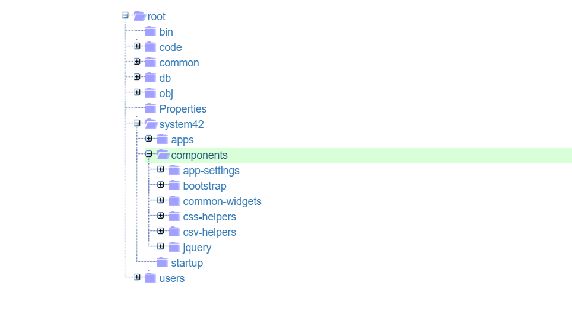
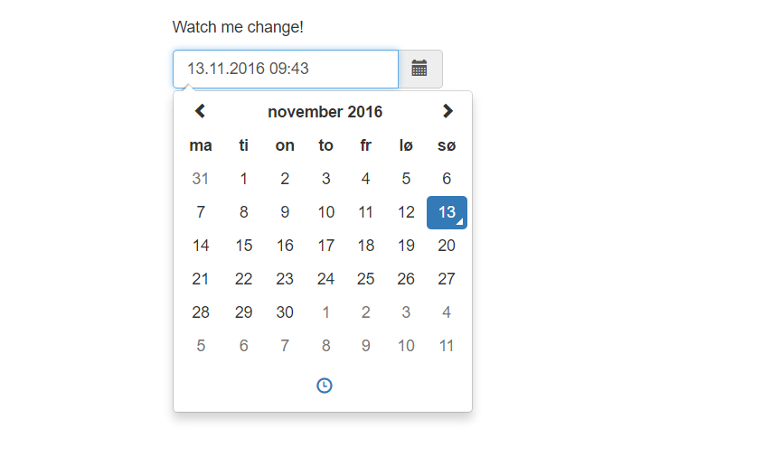

Ajax extension widgets
========

This folder contains the extension widgets for System42. An extension widget, is a widget that is more complex and rich than the 
default *[literal]*, *[container]* and *[void]* widgets. Internally, it is entirely created on top of the previously mentioned widgets,
but create far richer widgets, such as [Ajax DataGrids](datagrid/), [Ajax TreeViews](tree/) and so on.

They all follow the same ruleset, which is that they return one single _"native widget"_, which again contains zero or more children widgets.

Below is a screenshot of the Ajax TreeView widget for instance, to give you an idea.



The entire widget above, is actually created, using nothing but the _"native widgets"_, which gives you a very nice API for creating your own 
extension widgets.

This folder contains the pre-fabricated extension widgets in System42, and solves most of your problems, with widgets like for instance;

* [Ajax DataGrid](datagrid/)
* [Ajax TreeView](tree/)
* [Ajax TabControl](tab/)
* [Ajax Uploader](uploader/)
* plus many more ..

In addition, there are also some Bootstrap specific extension widgets, found in the [Bootstrap widget](../bootstrap/widgets/) folder. Examples are

* [Ajax DateTimePicker](../bootstrap/widgets/datetimepicker/)
* [Ajax ColorPicker](../bootstrap/widgets/colorpicker/)
* [Ajax Navbar](../bootstrap/widgets/navbar/)

An extension widget, is simply a widget, that can be used anywhere a _"native"_ widget can be used. This means, that instead of adding a 
plain *[literal]* widget, you add up an invocation to your own custom extension widget, which actually is nothing but an Active Event.

Below is an example of how to create an Ajax DateTimePicker for instance.

```
p5.web.widgets.create-container:foo
  parent:content
  class:col-xs-4
  widgets
    sys42.widgets.datetimepicker
```

Notice, instead of adding a *[literal]*, *[container]* or *[void]* into your *[widgets]* collection - We add a reference to our DateTimePicker 
through *[sys42.widgets.datetimepicker]* instead. The above code will resemble someething like the following.



## Creating your own extension widgets

Below is an example of how you could create your own extension widget yourself.

```
create-event:foo.my-widget
  return
    container
      class:input-group
      widgets
        literal
          class:input-group-addon
          innerValue:Foo bar
        void
          element:input
          type:text
          class:form-control
          placeholder:Foo goes here ...
          onchange
            sys42.windows.info-tip:Foo was changed!
```

If you execute the above code, in for instance the System42/Executor, for then to create a "lambda" page in your CMS, with the following code.

```
p5.web.widgets.create-container:foo
  parent:content
  class:col-xs-4
  widgets
    foo.my-widget
```

Then your result will look something like the following.


Assuming you've got bootstrap included on your page ...

This makes it very easy to stay _"DRY"_ in your Ajax apps - DRY means Don't Repeat Yourself - Simply by creating reusable Ajax widgets, for the HTML
and Widget hierarchies you tend to write over again.

The above widget, simply shows a *[sys42.windows.info-tip]* when its value is changed, but far richer widgets are easily created using the same logic.

