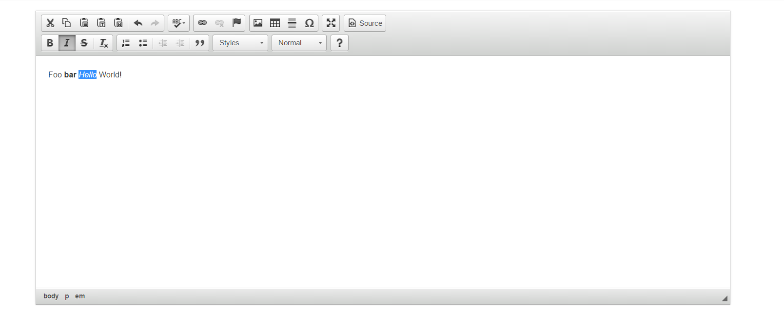

HTML WYSIWYG editor for Phosphorus Five
==========

Notice, this module is built on top of CKEditor, which is copyright (c) 2003-2016, CKSource - Frederico Knabben. Read 
more at the [CKEditor](http://ckeditor.com) website.

This component creates the CKEditor extension widget, accessible as *[sys42.widgets.ck-editor]*, which wraps CKEditor as a 
custom widget on your page. To use it, you could use something like the code below.

```
p5.web.widgets.create-container
  parent:content
  class:col-xs-12
  widgets
    sys42.widgets.ck-editor:my-editor
```

The above will render something like the following.



To get to HTML created by it, simply use *[p5.web.widgets.property.get]*, and pass in *[value]* as the argument of what to retrieve.
Example code given below.

```
p5.web.widgets.create-container
  parent:content
  class:col-xs-12
  widgets
    sys42.widgets.ck-editor:my-editor
      _value:"<p>Initial HTML</p>"
    button
      innerValue:Get HTML
      class:btn btn-default btn-attach-top
      onclick
        p5.web.widgets.property.get:my-editor
          value
        eval-x:x:/+/*
        sys42.windows.confirm
          header:Editor's content
          body:x:/@p5.web.widgets.property.get/*/*?value
```

## Ninja tricks

To find out which arguments any extension widget accepts, and that you can pass into it, you can use a generic lambda object, 
retrieving the *[_defaults]* section of an Active Event, such as illustrated below.

```
sys42.widgets.ck-editor
  add:x:/+
    src:x:/../*/_defaults/*
  return
```

This will return the all arguments, any extension widget accepts. Below is a list of the arguments the CKEditor extension widget accepts.

## Arguments

* [_height] - Height of editor in pixels. Defaults to 381.
* [_events] - Widget lambda events you wish to associate with widget.
* [_value] - Initial value of HTML editor.

All other properties are ignored, and for the most parts, don't really makes any sense, since the HTML textarea widget rendered, is actually
completely replaced at the client-side of things, by the CKEditor's internals.
