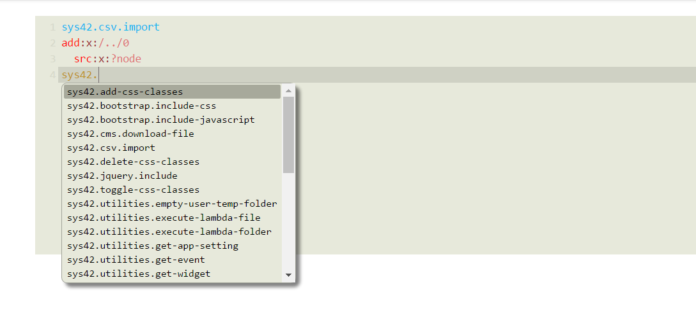

Hyperlambda Ajax editor for Phosphorus Five
==========

Notice, this module is built on top of CodeMirror, which is copyright (C) 2016 by Marijn Haverbeke - marijnh@gmail.com, and others.
CodeMirror is licensed under an MIT license. Read more [here](https://codemirror.net)

This component creates an Active Event for you, called *[sys42.widgets.codemirror]*, which wraps CodeMirror as an extension widget on 
your page, in Hyperlambda mode. To consume it, you could do something like the following code illustrates.

```
p5.web.widgets.create-container
  parent:content
  class:col-xs-12
  widgets
    sys42.widgets.codemirror:my-editor
```

The above will render something like the following.



To get to the Hyperlambda code, simply use *[p5.web.widgets.property.get]*, and pass in *[value]* as the argument of what to retrieve.
Example code given below.

```
p5.web.widgets.create-container
  parent:content
  widgets
    sys42.widgets.codemirror:my-editor
    button
      innerValue:Get Hyperlambda
      class:btn btn-default btn-attach-top
      onclick
        p5.web.widgets.property.get:my-editor
          value
        sys42.windows.show-lambda:x:/..
```

Which of course will return the Hyperlambda as plain text, and not transform it to lambda. To make lambda out of it, you can use
the *[hyper2lambda]* Active Event from [p5.hyperlambda](/plugins/p5.hyperlambda/).

Below is an example of a piece of code, that instantiates the CodeMirror editor, and upon clicking the _"Execute"_ button, evaluates 
your Hyperlambda. If you create a new lambda CMS page, and paste in the following code, you've created an _"edit and execute Hyperlambda"_ page.

```
p5.web.widgets.create-container
  parent:content
  widgets
    sys42.widgets.codemirror:my-editor
    button
      innerValue:Execute
      class:btn btn-default btn-attach-top
      onclick
        p5.web.widgets.property.get:my-editor
          value
        hyper2lambda:x:/-/*/*?value
        eval:x:/-
```

To find out which arguments you can pass into it, you can use the generic lambda object, retrieving the *[_defaults]* section
of an Active Event, such as illustrated below.

```
sys42.widgets.codemirror
  add:x:/+
    src:x:/../*/_defaults/*
  return
```

The arguments you can pass into it are as follows.

* [_auto-focus] - If true, sets focus automatically to widget when loaded
* [_mode] - Change the code mode here. At this time, only "hyperlambda" mode is supported
* [_theme] - Which theme to use. Defaults to "paraiso"
* [_height] - Height of widget. Remember to supply units (e.g. "px")
* [_value] - To set the initial Hyperlambda as the widget is loaded
* [_events] - Which lambda events to associate with widget

All other properties are ignored, and for the most parts, don't really give any sense, since the HTML "textarea" widget rendered, is actually
completely replaced at the client-side of things, by the CodeMirror's internals.

## Skinning your CodeMirror widget

You can also skin your CodeMirror widget with the following setting; _"sys42.code-mirror-default-theme"_. The setting is expected to be found in 
the _"sys42"_ app. To change your CodeMirror's skin to something darker, you can evaluate the following code for instance, in your Hyperlambda Executor.

```
sys42.settings.set:sys42.code-mirror-default-theme
  app:sys42
  src:paraiso-dark
```

Refresh your System42/Executor after evaluating the above code, to see the "dark" skin.

Notice, the _"sys42.code-mirror-default-theme"_ changes your CodeMirror's default theme. The theme can still be overridden by instantiating your CodeMirror
widget with a specific *[_theme]* argument.

There are only two skins distributed with P5 by default, these are;

* "paraiso" - A light skin
* "paraiso-dark" - A dark skin

But you can use any of the CodeMirror skins you wish. Check out the different skins you can use at the [CodeMirror](https://codemirror.net/demo/theme.html) website.
If you wish to use another skin, you will have to make sure it exist in the [theme](media/theme/) folder, and that its filename 
is _"xxx.min.css"_, where _"xxx"_ is the name of your skin.

## Creating a Hyperlambda Executor

In addition to the above CodeMirror widget, there is also another codemirror widget, which allows you to inject the entire System42's 
Hyperlambda Executor into your page. This is sometimes useful for debugging purposes, since it allows you to change your page, as it 
is being executed, from within the page's context.

This widget is created by the *[sys42.widgets.codemirror-executor]* Active Event. To see an example of it, create a new CMS "lambda" page, 
and paste in the following code.

```
p5.web.widgets.create-container
  parent:content
  widgets
    sys42.widgets.codemirror-executor
```
