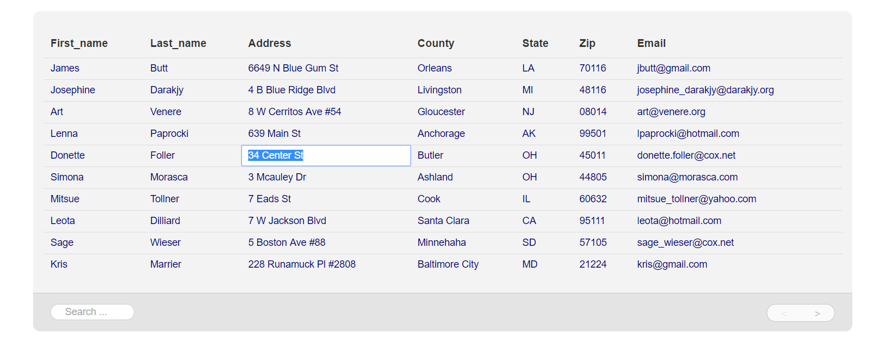
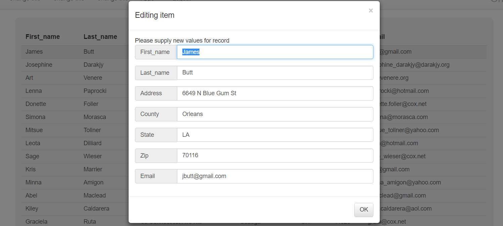
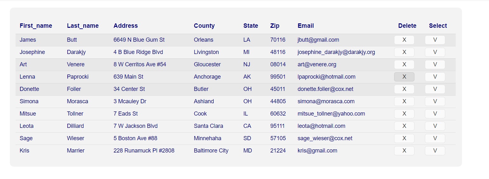

The fastest Ajax Datagrid on the planet
========

This folder contains, what is probably the fastest and smallest Ajax Datagrid on the planet. In its example implementation, it can be tweaked
down to ~8KB of content in total, which includes its CSS files, JavaScript, and HTML. It renders HTML back to the client, which
means it is very web friendly, compared to many other similar widgets, that entirely builds their DOM, based upon some JSON callback,
or similar technique.

To use it, simply add it to a container widget collection, through its widget creational Active Event *[sys42.widgets.datagrid]*. However,
before you can use it, you must make sure you somehow have data to display, which can be accomplished with the following code.

```
sys42.csv.import:/sample.csv
```

The above code, assumes you have a CSV file at the root of your [p5.webapp](/core/p5.webapp/) folder, who's name is _"sample.csv"_. You
can use any CSV file you wish, but the examples shown in this document, assumes its name is _"sample.csv"_.

You can find a nice dataset at [briandunning.com](https://www.briandunning.com/sample-data/us-500.zip), which contains 500 records of names.
Download the file, rename it to _"sample.csv"_, and put it into your main [p5.webapp](/core/p5.webapp/) directory, before evaluating the above
Hyperlambda.

After having evaluated the above Hyperlambda in for instance the CMS/Executor, you can create an Ajax Datagrid, by for instance putting 
the following code into a new _"lambda"_ page of System42's CMS.

```
create-widget:datagrid-wrapper-1
  parent:content
  class:col-xs-12
  widgets

    // Creates our datagrid.
    sys42.widgets.datagrid

      // Lambda invoked when datagrid needs items.
      .on-get-items
        if:x:/../*/_query?value
          p5.data.select:x:@"/*/*/sample.csv/*/""=:regex:/{0}/i""/./[{1},{2}]"
            :x:/../*/_query?value
            :x:/../*/_start?value
            :x:/../*/_end?value
        else
          p5.data.select:x:/*/*/sample.csv/[{0},{1}]
            :x:/../*/_start?value
            :x:/../*/_end?value
        add:x:/../*/return/*/items
          src:x:/../**/p5.data.select/*/sample.csv
        return
          items

      // Lambda invoked when an item has beeen in-place edited.
      .on-edit-item
        p5.data.update:x:@"/*/*/sample.csv/""=:guid:{0}""/*/{1}?value"
          :x:/../*/_row?value
          :x:/../*/_column?value
          src:x:/../*/_value?value
        return:bool:true
```

The above code, creates an Ajax Datagrid with support for inline editing of items, paging, and filtering (search).

Assuming you've imported som CSV file, the above code will create something resembling the following for you, depending upon how your CSV file
looks like.



The *[items]* collection the datagrid expects in your *[.on-get-items]* lambda callback, should look something like this.

```
return
  items
    item:some-id-1
      name:John Doe
      email:john@doe.com
    item:some-id-2
      name:Jane Doe
      email:jane@doe.com
```

The _"some-id-XX"_ is the ID of your data row, and its children nodes are the column names and values. In the above example, we have
two rows, with two columns each, named; _"name"_ and _"email"_.

## Turning off editing of cells and rows

The Datagrid can be customized in many ways. If you wish to turn off editing of some of your columns, you can simply add an *[_edit]*
child node, to your data, as you return it in your *[.on-get-items]* lambda callback, annd make sure you set its value to _"false"_.

```
return
  items
    item:some-id-1
      name:John Doe
        edit:bool:false
      email:john@doe.com
    item:some-id-2
      name:Jane Doe
        edit:bool:false
      email:jane@doe.com
```

In the above example, we have two items, with two columns; _"name"_ and _"email"_. The names cannot be edited, because of the *[_edit]*
argument passed in with a value of "false". However, the emails can be edited, using inline editing. Below is an example of a Datagrid
that eliminates editing of the first column, but allows editing of all other columns.

```
create-widget:datagrid-wrapper-2
  parent:content
  class:col-xs-12
  widgets
    sys42.widgets.datagrid
      .on-get-items
        if:x:/../*/query?value
          p5.data.select:x:@"/*/*/sample.csv/*/""=:regex:/{0}/i""/./[{1},{2}]"
            :x:/../*/query?value
            :x:/../*/start?value
            :x:/../*/end?value
        else
          p5.data.select:x:/*/*/sample.csv/[{0},{1}]
            :x:/../*/start?value
            :x:/../*/end?value
        add:x:/../*/return/*/items
          src:x:/../**/p5.data.select/*/sample.csv

        // Here we make sure that the zero'th column is not editable.
        add:x:/../*/return/*/*/0
          src:"edit:bool:false"
        return
          items
      .on-edit-item
        p5.data.update:x:@"/*/*/sample.csv/""=:guid:{0}""/*/{1}?value"
          :x:/../*/row?value
          :x:/../*/column?value
          src:x:/../*/value?value
        return:bool:true
```

Notice, you can also turn off editing of specific cells this same way. The *[_edit]* argument, can be added to only cells with some specific
values if you wish.

The *[.on-edit-item]* lambda callback, is invoked when some cell of your datagrid has been successfully edited. This can be done, by
clicking the cell, typing in a new value, and hitting carriage return. *[.on-edit-item]* will be given three important arguments;

* [row] - Which is the id of your row
* [column] - Which is the name of the column edited
* [value] - Which is the new value the user supplied

The *[.on-get-items]* lambda callback, is given at least two arguments;

* [start] - Which is the zeroth index start of the data it wants
* [end] - Which is the end of the data it wants

The logic of the above two arguments, are as follows; _"from and including start, to but not including end"_.

In addition, your *[.on-get-items]* callback, _might_ get a *[query]* argument, which is a filter condition, that your dataset
somehow must match. By default, the search textbox, if the user enters a value, will pass this value into your callback.

## Row selection

You can also set the datagrid in _"row selection"_ mode. In this mode, inline editing of items are disabled, and the user can instead 
choose to select an entire row. This is done by dropping the *[.on-edit-item]* callback, and instead supply an *[.on-select-items]*
lambda callback.

In addition, you can change the size of your pages by passing in *[_page-size]* with an integer value of how many records you wish to 
show for each page.

In the example below, we have increased the page size to 5, and turned on row selection instead of inline editing, where we show
a modal wizard window, allowing the user to edit his items in a modal window instead.

```
create-widget:datagrid-wrapper-3
  parent:content
  class:col-xs-12
  widgets

    /*
     * Creating our Ajax datagrid, as a child of our "host widget".
     */
    sys42.widgets.datagrid:my-datagrid-3
      
      // Number of items to show per page.
      page-size:5
      
      /*
       * User specific callback lambda, invoked when our datagrid needs
       * more items.
       * The datagrid will pass in at the very least [_start] and [_end],
       * possibly also [_query], of the grid has been "filtered".
       */
      .on-get-items
        if:x:/../*/query?value

          // We have a query, or filter.
          p5.data.select:x:@"/*/*/sample.csv/*/""=:regex:/{0}/i""/./[{1},{2}]"
            :x:/../*/query?value
            :x:/../*/start?value
            :x:/../*/end?value
        else

          // No filter or query was supplied.
          p5.data.select:x:/*/*/sample.csv/[{0},{1}]
            :x:/../*/start?value
            :x:/../*/end?value

        // Adding result of above select into [return]/[items].
        add:x:/../*/return/*/items
          src:x:/../**/p5.data.select/*/sample.csv

        return
          items

      /*
       * User provided callback lambda for what happens when an 
       * item is selected.
       * Notice, you can not supply both [.on-edit-item] and [.on-select-items].
       */
      .on-select-items

        /*
         * Selecting currently clicked record from database, and passing
         * values, and ID, into our wizard window.
         */
        p5.data.select:x:@"/*/*/sample.csv/""=:guid:{0}"""
          :x:/../*/items/*?name
        set:x:/../*/sys42.windows.wizard/**/_id?value
          src:x:/../*/items/*?name
        add:x:/+/*/data
          src:x:/../*/p5.data.select/*/*

        /*
         * Showing our wizard dialogue, allowing user to edit item.
         */
        sys42.windows.wizard
          header:Editing item
          body:Please supply new values for record
          data
          .onok

            // Contains ID of row
            _id

            /*
             * Selecting record from database, and changes the content of
             * [p5.data.select] from the values entered by user.
             */
            p5.data.select:x:@"/*/*/sample.csv/""=:guid:{0}"""
              :x:/@_id?value
            sys42.windows.wizard.get-values
            for-each:x:/@p5.data.select/*/*
              set:x:/@_dp/#?value
                src:x:/@sys42.windows.wizard.get-values/*/{0}?value
                  :x:/@_dp/#?name

            /*
             * Updating data, setting the source for our update operation to the
             * content of [p5.data.select], which at this point is modified, to contain
             * the new values, provided by user.
             */
            p5.data.update:x:@"/*/*/sample.csv/""=:guid:{0}"""
              :x:/@_id?value
              src:x:/@p5.data.select/*
            sys42.widgets.datagrid.databind:my-datagrid-3
```

In our above example, we have completely dropped the *[.on-edit-item]* callback, and instead provided an *[.on-select-items]*. This
ensures the user can select a row, instead of inline editing a cell's content. This lambda callback is mutually exclusive with 
the *[.on-edit-item]* callback. Meaning, you must choose one of them, and not both!

The above code, will create something looking like the following, asssuming you've got some CSV file in your database.



## Adding additional pager widgets

If you wish, you can inject your own additional widgets in between the _"previous"_ and _"next"_ buttons in the pager. This is done through adding
your own *[_pager-widgets]* collection, which becomes a *[widget]* collection stuffed in between the previous and next buttons. Consider the 
following.

```
create-widget:datagrid-wrapper-4
  parent:content
  class:col-xs-12
  widgets

    // Creates our datagrid.
    sys42.widgets.datagrid

      pager-widgets
        a
          href:#
          role:button
          innerValue:Foo bar
          onclick
            sys42.windows.info-tip:Foo bar was clicked

      // Lambda invoked when datagrid needs items.
      .on-get-items
        if:x:/../*/query?value
          p5.data.select:x:@"/*/*/sample.csv/*/""=:regex:/{0}/i""/./[{1},{2}]"
            :x:/../*/query?value
            :x:/../*/start?value
            :x:/../*/end?value
        else
          p5.data.select:x:/*/*/sample.csv/[{0},{1}]
            :x:/../*/start?value
            :x:/../*/end?value
        add:x:/../*/return/*/items
          src:x:/../**/p5.data.select/*/sample.csv
        return
          items

      // Lambda invoked when an item has beeen in-place edited.
      .on-edit-item
        p5.data.update:x:@"/*/*/sample.csv/""=:guid:{0}""/*/{1}?value"
          :x:/../*/row?value
          :x:/../*/column?value
          src:x:/../*/value?value
        return:bool:true
```

The above Hyperlambda, simply injects a hyperlink, button type of widget, which once clicked, shows an _"info-tip"_ window. Feel free to add 
anything you wish in here though.

Although you could technically put any type of widgets you wish in the *[_pager-widgets]* collection, you'd probably have to style them, in your
own CSS, unless you add a hyperlink _"a"_ element type of widget, to not mess up the layoutof the datagrid.

## Template columns

If you wish, you can also create _"template columns"_, which are columns where you have 100% control over what goes into every cell
of your datagrid. Using this technique, you can put any other Ajax widgets you wish, into the cells of your datagrid. This is done
by returning a row in your *[.on-get-items]* callback, which contains a child node named *[widgets]*. The *[widgets]* collection,
is expected to be a collection with at least one, or more widgets, which will be appended into the *[widgets]* child collection of
your "td" HTML widget.

To create a "template column", you could return something like the following from your *[.on-get-items]*;

```
.on-get-items
  return
    items
      item:item1
        foo:foo1
        bar:bar1
        foo-bar
          widgets
            button
              class:btn btn-default
              innerValue:Click me
              onclick
                sys42.windows.info-tip:I was clicked!
      item:item2
        foo:foo2
        bar:bar2
        foo-bar
          widgets
            button
              class:btn btn-default
              innerValue:Click me too!
              onclick
                sys42.windows.info-tip:I was clicked!
```

Notice, if you want to use _"template columns"_, you should not use it in combination with _"row selection"_, since this would confuse the
datagrid rendering, having a clickable button, inside of a clickable row. Below is a complete example of how to create a more relevant
template column datagrid, with two template columns. One row allowing you to delete your items, and the other row allowing you to
select your items.

```
create-widget:datagrid-wrapper-5
  parent:content
  class:col-xs-12
  widgets

    /*
     * Creating our Ajax datagrid, as a child of our "host widget".
     */
    sys42.widgets.datagrid:my-datagrid

      // If false, then no paging or searching bar at the bottom will be created.
      show-pager:false

      /*
       * User specific callback lambda, invoked when our datagrid needs
       * more items.
       * The datagrid will pass in at the very least [_start] and [_end],
       * possibly also [_query], of the grid has been "filtered".
       */
      .on-get-items
        if:x:/../*/_query?value

          // We have a query, or filter.
          p5.data.select:x:@"/*/*/sample.csv/*/""=:regex:/{0}/i""/./[{1},{2}]"
            :x:/../*/query?value
            :x:/../*/start?value
            :x:/../*/end?value
        else

          // No filter or query was supplied.
          p5.data.select:x:/*/*/sample.csv/[{0},{1}]
            :x:/../*/start?value
            :x:/../*/end?value

        // Adding result of above select into [return]/[items].
        add:x:/../*/return/*/items
          src:x:/../**/p5.data.select/*/sample.csv

        /*
         * Adding a custom column at the end, allowing for deletion of items.
         */
        insert-after:x:/../*/return/*/items/*/0/-
          src
            delete
              widgets
                button
                  innerValue:X
                  onclick
                    sys42.widgets.datagrid.get-row-id:x:/../*/_event?value
                    eval-x:x:/+/*/*/p5.data.delete/0
                    sys42.windows.confirm
                      header:Confirm deletion
                      body:Are you sure you wish to delete this item?
                      .onok
                        p5.data.delete:x:@"/*/*/""=:guid:{0}"""
                          :x:/../*/sys42.widgets.datagrid.get-row-id?value
                        sys42.widgets.datagrid.databind:my-datagrid
            select
              widgets
                button
                  innerValue:V
                  onclick
                    p5.web.widgets.find-ancestor:x:/../*/_event?value
                      _row
                    sys42.utilities.toggle-css-classes:x:/-/*/*?value
                      class:selected
        return
          items

      /*
       * User provided callback lambda code, for what happens when an
       * item has been edited using "in place editing".
       */
      .on-edit-item
        p5.data.update:x:@"/*/*/sample.csv/""=:guid:{0}""/*/{1}?value"
          :x:/../*/row?value
          :x:/../*/column?value
          src:x:/../*/value?value
        return:bool:true

      /*
       * User provided callback lambda code, for what happens when a
       * column header is clicked.
       */
      .on-header-clicked
        p5.web.widgets.property.get:x:/../*/_event?value
          innerValue
        sys42.windows.info-tip:'{0}' was clicked.
          :x:/@p5.web.widgets.property.get/*/*?value
```

In the above example, we have also turned of the entire footer, effectively disabling paging and searching/filtering your items.
The above example, will produce something resembling the following.



The Ajax Datagrid has a relatively rich API, which allows you to create your own controls, where you replace its functionality, with your 
own logic and/or UI.

## Clickable headers

Our last example above, also demonstrate how to turn on _"clickable headers"_. By default, the headers of your Datagrid are not clickable.
You can easily turn this on though, by adding your own *[.on-header-clicked]* lambda callback when creating your grid. This makes sure 
your datagrid's headers becomes clickable, which you could use to for instance sort your data, filter according to columns, etc, etc, etc.

In our example above, we simply retrieve the name of the column that was clicked, before we show a *[sys42.windows.info-tip]* window,
showing the name of the column that was clicked. You are free to implement any logic you wish here though, including sorting, deletion of column,
etc, etc, etc.

## Not accepting input

If you have the datagrid in _"in-place editing mode"_, you can choose to not accept the values from the user, for any reasons you wish.
This is simply done by return _"false"_ from your *[.on-edit-item]* lambda callback. Consider the following, that accepts all input, except
if your input is _"error"_, at which point it does not accept your new value.

```
create-widget:datagrid-wrapper-6
  parent:content
  class:col-xs-12
  widgets

    // Creates our datagrid.
    sys42.widgets.datagrid

      // Lambda invoked when datagrid needs items.
      .on-get-items
        if:x:/../*/query?value
          p5.data.select:x:@"/*/*/sample.csv/*/""=:regex:/{0}/i""/./[{1},{2}]"
            :x:/../*/query?value
            :x:/../*/start?value
            :x:/../*/end?value
        else
          p5.data.select:x:/*/*/sample.csv/[{0},{1}]
            :x:/../*/start?value
            :x:/../*/end?value
        add:x:/../*/return/*/items
          src:x:/../**/p5.data.select/*/sample.csv
        return
          items

      // Lambda invoked when an item has beeen in-place edited.
      .on-edit-item

        // Checking if user types in "error" as new value, and if so, rejecting new value.
        if:x:/../*/value?value
          =:error
          return:bool:false
        p5.data.update:x:@"/*/*/sample.csv/""=:guid:{0}""/*/{1}?value"
          :x:/../*/row?value
          :x:/../*/column?value
          src:x:/../*/value?value
        return:bool:true
```

If you type _"error"_ into any cell in the above datagrid, then the datagrid will not close the textbox, and add some error classes, that shows 
your textbox with some red border.

## Alternative types of in-place editors

If you wish, you can also override the default type of textbox, used for editing an item, by return a *[_type]* child from 
your *[.on-get-items]* callback. Below we are for instance using a number type of textbox, for editing the 5th column in our datagrid.

Notice, this requires that the data for your 5th column actually is a number, and not some plain text.

```
create-widget:datagrid-wrapper-6
  parent:content
  class:col-xs-12
  widgets

    // Creates our datagrid.
    sys42.widgets.datagrid

      // Lambda invoked when datagrid needs items.
      .on-get-items
        if:x:/../*/query?value
          p5.data.select:x:@"/*/*/sample.csv/*/""=:regex:/{0}/i""/./[{1},{2}]"
            :x:/../*/query?value
            :x:/../*/start?value
            :x:/../*/end?value
        else
          p5.data.select:x:/*/*/sample.csv/[{0},{1}]
            :x:/../*/start?value
            :x:/../*/end?value
        add:x:/../*/return/*/items
          src:x:/../**/p5.data.select/*/sample.csv

        // Here we make sure that the 5th column in-place editor becomes a number
        // type of textbox.
        add:x:/../*/return/*/items/*/5
          src
            type:number
        return
          items

      // Lambda invoked when an item has beeen in-place edited.
      .on-edit-item

        p5.data.update:x:@"/*/*/sample.csv/""=:guid:{0}""/*/{1}?value"
          :x:/../*/row?value
          :x:/../*/column?value
          src:x:/../*/value?value
        return:bool:true
```

If you want more advanced type of in-place editors, you're going to have to create a *[template]* column. See above how to do this.

