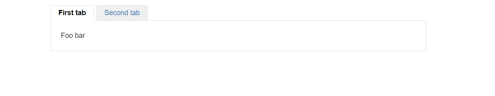
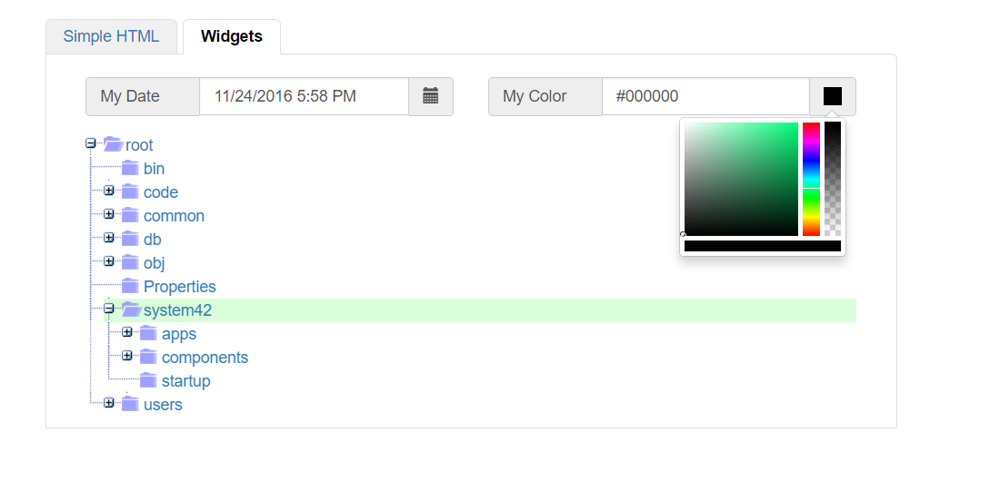

An Ajax TabControl widget
========

This folder contains the Ajax TabControl widget in Phosphorus Five. This widget, allows you to create a tabbed view, with multiple tabs,
showing some aspecct of your page. Kind of like the TabControl in for instance windows. In addition, it allows for search engines to crawl
its items, without adding the additional overhead of having to initially render the inactive items. Below is an example.

```
create-widget:my-tabs
  parent:content
  class:col-xs-12
  widgets
    sys42.widgets.tab
      items
        First tab
          widgets
            literal
              innerValue:Foo bar
        Second tab
          widgets
            literal
              innerValue:Some other value
```

The above example, produces the following.



As you switch the tab in the above TabControl widget, the tabview you switch to, becomes visible. Each node beneath the *[_items]* collection,
becomes one _"TabView"_. Each item inside of your *[_items]* collection, is expected to have its own set of *[widgets]*. You can really put
any widget you wish into these, including complex widgets.

The TabControl has the following arguments.

* [skin] - Skin to use, default value is "default".
* [items] - TabView items, each having its own separated *[widgets]* collection.
* [crawl] - If true, will allow for search engines, and crawlers, to "crawl" your TabControl.
* [crawl-get-name] - HTTP GET parameter used when crawling items.

Notice, if you set the TabControl into _"crawlable mode"_, you must also provide a value for all you *[_items]*. This value becomes the
value of the HTTP GET parameter used when crawling your TabControl. Below is an example of a _"SEO friendly and crawlable TabControl"_.

```
p5.web.widgets.create-container:foo
  parent:content
  class:col-xs-8
  widgets
    sys42.widgets.tab
      crawl:true
      crawl-get-name:tab-view
      items
        First tab:item-1
          widgets
            literal
              innerValue:Foo bar
        Second tab:item-2
          widgets
            literal
              innerValue:Some other value
```

Create a _"lambda"_ page in your CMS, and paste in the code above, and then when you view your page, click the second tab, and choose "Open 
in new window". If you do, you will see that it opens up with the URL being something like the 
following `http://localhost:1176/change-this-5?tab-view=item-2`

This ensures that the TabControl is crawlable, since search engines, and other crawlers, will simply see your TabControl header buttons as hyperlinks.
While still preserving Ajax functionality when a TabView button is clicked by a user.

## Ninja tricks

The TabControl widget, does not in any ways show the children *[widgets]* collection of its tabviews, before these are actually shown, by for
instance clicking on the tabview button, that shows it. This means that you can inject complex widgets into it, and not pay the penalty for
them, before they're actually shown. Consider this code.

```
create-widget:foo
  parent:content
  class:col-xs-8
  widgets
    sys42.widgets.tab
      crawl:true
      crawl-get-name:tab-view
      items
        Simple HTML:item-1
          widgets
            literal
              innerValue:@"<h3>Simple literal</h3><p>This is a paragraph</p>"
        Widgets:item-2
          widgets
            container
              class:col-xs-6 prepend-bottom
              widgets
                sys42.widgets.datetimepicker:my-date
                  _label:My date
            container
              class:col-xs-6 prepend-bottom
              widgets
                sys42.widgets.colorpicker
                  label:My color
            container
              class:col-xs-12
              widgets
                sys42.widgets.tree
                  items
                    root:/
                  .on-get-items
                    list-folders:x:/../*/_item-id?value
                    for-each:x:/-/*?name
                      list-folders:x:/./*/_dp?value
                      p5.string.split:x:/./*/_dp?value
                        =:/
                      add:x:/../*/return/*
                        src:@"{0}:{1}"
                          :x:/..for-each/*/p5.string.split/0/-?name
                          :x:/..for-each/*/_dp?value
                      if:x:/@list-folders/*
                        not
                        add:x:/../*/return/*/items/0/-
                          src
                            class:tree-leaf
                    return
                      items
```

The above code, in its default, and visible tab, only shows some static HTML widget. However, in its second tabview, it shows a complex
widget hierarchy, with an Ajax TreeView, an Ajax DateTimePicker and an Ajax Colorpicker. These complex widgets, requires a lot of JavaScript
to be downloaded to the client. However, this JavaScript, and the rest of the initialization for these widgets, are not in any ways included
on the page, before the user actually physically clicks the TabView that displays them. This means, that even though our page, as a total,
includes tons of complex widgets, with additional JavaScript pages, the user does not pay for these complex widgets, before he or she actually
clicks on the TabView that displays these.

The above code, when you click the second tabview, will show something resembling this for the record.



To understand what this means, please use the _"Inspect"_ feature of e.g. Google Chrome, to see what goes over the wire, as you click the
second tab. In fact, if you go even further, and use the _"empty"_ CMS template when creating the above TabControl in a CMS "lambda" page,
not even Bootstrap or jQuery will be included, before you actually show the second TabView, by clicking the _"Widgets"_ TabView button.

This means that the initial bandwidth usage of the page as a whole, becomes no more than 6.7KB in total. While when you click the second TabView,
an additional 145KB will be downloaded, and the JavaScript and CSS necessary to show these complex widgets, will be automatically downloaded
and included on your page.

### Handling TabView activated event

The TabControl does not have any *[.on-active-tab]* property. However, trapping it none the less, is actually quite easy. If you add your 
own *[oninit]* callback in one of your widgets, inside one of your tabviews, you can actually easily create a piece of lambda, that is executed 
everytime a specific tabview becomes active. Consider the following code.

```
create-widget:my-tabs
  parent:content
  class:col-xs-12
  widgets
    sys42.widgets.tab
      items
        First tab
          widgets
            literal
              innerValue:Foo bar
        Second tab
          widgets
            literal
              oninit
                sys42.windows.info-tip:Second tab was activated!
              innerValue:Some other value
```

The above Hyperlambda will create a TabControl, which shows an _"info-tip"_, every time the 2nd tabview becomes active.
