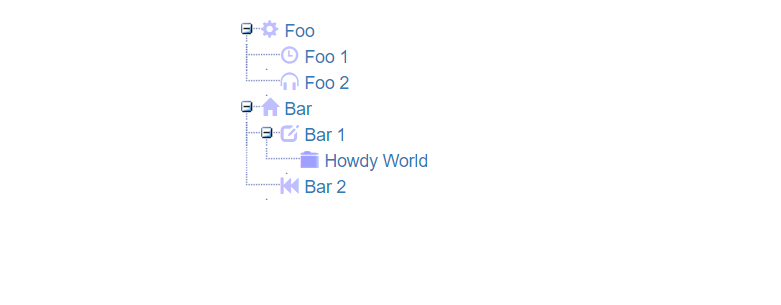
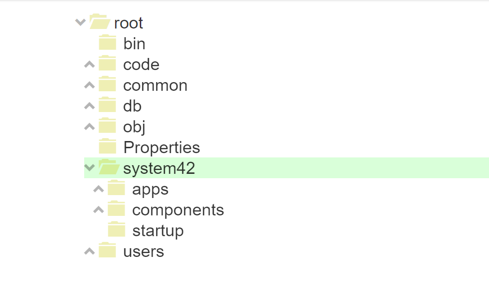

An SEO Ajax TreeView widget
========

This folder contains the Ajax extension TreeView widget, that can be traversed by search engines, and even allows you to bookmark
items in it, by for instance by right clicking and item, and choose _"Open in new tab"_.

To use it, simply add it to a container widget collection, through its widget creational Active Event *[sys42.widgets.tree]*. Example below.

```
p5.web.widgets.create-container
  parent:content
  widgets
    sys42.widgets.tree
      crawl:true
      items
        root:/
      .on-get-items
        p5.io.folder.list-folders:x:/../*/_item-id?value
        for-each:x:/-/*?name
          p5.io.folder.list-folders:x:/./*/_dp?value
          p5.string.split:x:/./*/_dp?value
            =:/
          add:x:/../*/return/*
            src:@"{0}:{1}"
              :x:/..for-each/*/p5.string.split/0/-?name
              :x:/..for-each/*/_dp?value
          if:x:/./*/p5.io.folder.list-folders/*
            not
            add:x:/../*/return/*/items/0/-
              src
                class:tree-leaf
        return
          items
```

The above example allows you to traverse your folders in your Phosphorus Five installation, using the Ajax tree widget. It will look something
like the following.


Notice, if you right click an item, and choose _"Open in new tab"_ for instance, then the URL opened, will unroll the TreeView,
to whatever item you choose. This is due to the *[crawl]* parameter being set to true. This works by adding an HTTP GET parameter to
the current URL, which contains the IDs of every single item, separated by "|", necessary to toggle, to open up the tree, to the point
you requested. This is done on the server, and hence makes the TreeView very _"SEO friendly"_, in addition to allowing your users to
bookmark items. If you wish to override the name of the HTTP GET parameter used for this operation, you can do so with 
the *[crawl-get-name]* argument while creating your tree.

You can also add your own item root CSS class for your items. In the above example, we add the class _"tree-leaf"_, which removes the
expand icon on items, through the *[_class]* argument on each item inside of your *[items]* collection. In our next example we will see 
this more accurately, using a bunch of statically loaded items.

The *[items]* collection, are your initial items for when the widget is created. If wish, you can supply an initial set of *[items]*,
that have children items themselves, such as this example shows you.

```
p5.web.widgets.create-container
  parent:content
  class:col-xs-12
  widgets
    sys42.widgets.tree
      items
        Foo:foo
          items
            Foo 1:foo-1
              class:tree-leaf
            Foo 2:foo-2
              class:tree-leaf
        Bar:bar
          items
            Bar 1:bar-1
              items
                Howdy World:tjobing-1
                  class:tree-leaf
            Bar 2:bar-2
              class:tree-leaf
```

As the above example also illustrates, you can also have multiple root items. There must however be at least _one_ item, otherwise the
widget will throw an exception during initialization.

You can also override the CSS class(es) used for specific items, both their _"open state"_ and their _"closed state"_ classes. Below is an 
example of this.

```
p5.web.widgets.create-container
  parent:content
  class:col-xs-12
  widgets
    sys42.widgets.tree
      items
        Foo:foo
          class-close:glyphicon glyphicon-wrench
          class-open:glyphicon glyphicon-cog
          items
            Foo 1:foo-1
              class-close:glyphicon glyphicon-time
              class:tree-leaf
            Foo 2:foo-2
              class-close:glyphicon glyphicon-headphones
              class:tree-leaf
        Bar:bar
          class-close:glyphicon glyphicon-trash
          class-open:glyphicon glyphicon-home
          items
            Bar 1:bar-1
              class-close:glyphicon glyphicon-picture
              class-open:glyphicon glyphicon-edit
              items
                Howdy World:tjobing-1
                  class-open:glyphicon glyphicon-picture
                  class:tree-leaf
            Bar 2:bar-2
              class-close:glyphicon glyphicon-fast-backward
              class:tree-leaf
```

The above example, will produce something like the following.



The default icons used if no CSS class is explicitly added is _"glyphicon glyphicon-folder-close folder"_ and "glyphicon glyphicon-folder-open folder"
from Bootstrap CSS. The _"folder"_ CSS class, simply adds the default background image, if Bootstrap is not included. Although the TreeView
renders with more icon types if you include Bootstrap CSS, it is not dependent upon it in any ways. If you do not include Bootstrap, and
you do not override its CSS classes, it will render a folder open/close background image, with fixed width and height. If this does not fit
your needs, feel free to either include Bootstrap, or override the default CSS classes as the above example illustrates.

To see how to do include Bootstrap, check out the documentation for the [Bootstrap CSS](../../bootstrap/) module. The default template used in your CSS
automatically includes Bootstrap though.

Notice, all arguments are optional, except the *[_items]* collection, that must have, at the very least, minimum _one_ item. Making the
smallest possible code to use the Tree view look something like this.

```
p5.web.widgets.create-container
  widgets
    sys42.widgets.tree
      items
        Foo:foo
```

Of course, unless you supply an *[.on-get-items]* callback lambda, then no new items can possibly be appended to your tree view, and it will
only show the items you initially feed it with. If you wish to being able to dynamically feed your widget with new items, you must add
the *[.on-get-items]* lambda callback, where you are expected to return an *[items]* collection, resembling the *[items]* collection you
initially gave it when the widget was created.

You can also toggle multiple items at the same time, by returning a nested *[items]* collection, as the following demonstrates.

```
create-widget
  parent:content
  widgets
    sys42.widgets.tree
      items
        Root:root
      .on-get-items
        if:x:/../*/_item-id?value
          =:root
          return
            items
              Foo 1:foo-1
                items
                  Foo 1's child 1:foo-1-1
                    class:tree-leaf
                  Foo 1's child 2:foo-1-2
                    class:tree-leaf
                  Foo 1's child 3:foo-1-3
                    class:tree-leaf
              Bar 1:bar-1
                items
                  Bar 1's child 1:bar-1-1
                    class:tree-leaf
                  Bar 1's child 2:bar-1-2
                    class:tree-leaf
```

## Handling selected event

If you wish, you can supply an *[.on-select]* lambda callback, which will be invoked when the user is selecting items in your tree.
Your lambda callback will be given a collection of *[items]*, where the name property of the node, is the ID of the item selected.

Below is an example of a TreeView widget that simply shows an _"info tip box"_ as the user selects items.

```
create-widget
  parent:content
  class:col-xs-12
  widgets
    sys42.widgets.tree
      .on-select
        sys42.windows.info-tip:You selected '{0}'
          :x:/../*/items/0?name
      items
        Foo:foo
          items
            Foo 1:foo-1
            Foo 2:foo-2
        Bar:bar
          items
            Bar 1:bar-1
              items
                Howdy World:tjobing-1
            Bar 2:bar-2
```

## Selecting multiple items

Although there is no user interface for the widget by default, to allow for the user to select multiple items, this is still possible to
achieve using its API. The *[sys42.widgets.tree.select-items]* lambda widget event, allows you to select multiple items. Below is an example.
Click the button to select both the _"foo-1"_ and the _"bar-2"_ item.

```
p5.web.widgets.create-container
  parent:content
  class:col-xs-12
  widgets
    sys42.widgets.tree:my-tree
      items
        Foo:foo
          items
            Foo 1:foo-1
            Foo 2:foo-2
        Bar:bar
          items
            Bar 1:bar-1
              items
                Howdy World:tjobing-1
            Bar 2:bar-2
    literal
      class:btn btn-default
      innerValue:Select two items
      onclick
        sys42.widgets.tree.select-items:my-tree
          items
            foo-1
            bar-2
```

Hint, you can also, by using its API, _"unroll"_ items, or _"toggle"_ items, by invoking the *[sys42.widgets.tree.toggle-items]* Active Event.
Which takes the exact same set of parameters as the *[sys42.widgets.tree.select-items]* event. Below is an example of toggling (collapsing)
two items in your tree, through clicking a button.

```
create-widget
  parent:content
  class:col-xs-12
  widgets
    sys42.widgets.tree:my-tree
      items
        Foo:foo
          items
            Foo 1:foo-1
            Foo 2:foo-2
        Bar:bar
          items
            Bar 1:bar-1
              items
                Howdy World:tjobing-1
            Bar 2:bar-2
    literal
      class:btn btn-default
      innerValue:Toggle two items
      onclick
        sys42.widgets.tree.toggle-items:my-tree
          items
            foo
            bar-1
```

The *[sys42.widgets.tree.toggle-items]* Active Event, optionally takes a *[force-expand]* argument, which if set to true, will not collapse
items that are already expanded, but exclusively open already collapsed items.

## Retrieving currently selected items

The tree widget also supports retrieving currently selected items, through its *[sys42.widgets.tree.get-selected-items]* Active Event.
Below is an example of usage. Select any item in your tree, and then click the button.

```
create-widget
  parent:content
  class:col-xs-12
  widgets
    sys42.widgets.tree:my-tree
      items
        Foo:foo
          items
            Foo 1:foo-1
            Foo 2:foo-2
        Bar:bar
          items
            Bar 1:bar-1
              items
                Howdy World:tjobing-1
            Bar 2:bar-2
    literal
      class:btn btn-default
      innerValue:Get selected item(s)
      onclick
        sys42.widgets.tree.get-selected-items:my-tree
        sys42.windows.info-tip:You selected '{0}'
          :x:/../*/sys42.widgets.tree.get-selected-items/0/0?name
```

Notice, the *[sys42.widgets.tree.get-selected-items]* event, might return also 0 or multiple items, depending upon how many items the user has selected, 
and if you have somehow selected multiple items through its API, or something similar.

## Styling your Ajax tree widget

You can also override the skin used for the TreeView widget. To use another skin, pass in the skin you wish to use as a *[skin]* argument. 
The default value here is _"default"_, which is the CSS found in the _"default/default.min.css"_ file.

Besides from this file, the widget is not dependent upon any CSS files in any ways, except of the default icons for closed and opened
icon items, which are taken from the _"glyphicons"_ from Bootstrap CSS. If you wish to use other glyphicons, you can see the entire list
of available icons at the [Bootstrap CSS website](http://getbootstrap.com/components/). You can of course use your own icons, independently
of the glyphicons from Bootstrap, at which case you no longer need to include Bootstrap.

If you use the glyphicons, you are yourself responsible for making sure you include Bootstrap CSS, which can be done, by reading the 
documentation for the System42 [Bootstrap CSS module](../../bootstrap/). You only need to include the CSS file
though, and not any of the JavaScript files. As previously said though, the default template of the CMS, automatically includes Bootstrap.

Below is the exact same example we started out with, except with a different skin, which creates a larger TreeView, more suitable for
smartphones and smaller devices.

```
create-widget
  parent:content
  widgets
    sys42.widgets.tree
      skin:large
      items
        root:/
      .on-get-items
        list-folders:x:/../*/_item-id?value
        for-each:x:/-/*?name
          list-folders:x:/@_dp?value
          split:x:/./*/_dp?value
            =:/
          add:x:/../*/return/*
            src:@"{0}:{1}"
              :x:/@split/0/-?name
              :x:/@_dp?value
          if:x:/@list-folders/*
            not
            add:x:/../*/return/*/items/0/-
              src
                class:tree-leaf
        return
          items
```

The above example will render something like the following.



## Bandwidth usage

The Ajax TreeView widget actually does not itself use any custom JavaScript, besides the core JavaScript from p5.ajax, which in its
minified version, is roughly 2.8KB of JavaScript. In addition, it uses only three tiny images by default, and one tiny CSS
file. So in its absolutely minimum version, without Bootstrap included, the entire download for your clients, is less than 10KB for the
initial loading. And as you expand items, it loads an addition ~1KB for each Ajax request, depending upon how many items you return.

Everything is transferred from the server as JSON (which is the default behavior of [p5.ajax](/core/p5.ajax/), and the bandwidth usage for
expanding two items with 3 and 2 children items each, becomes ~1.2KB of JSON transferred from your server.

## Server resource consumption

The widget will only request new items when an item is initially expanded through your supplied *[.on-get-items]* lambda callback. On consecutive
expansions for the same items, it will simply remove a _"hide"_ CSS class on the client, never invoking your get items lambda callback.

This means it is also very cheap in regards to server resource usage, if the user is expanding and hiding the same items, looking for 
some specific node, in your tree.
