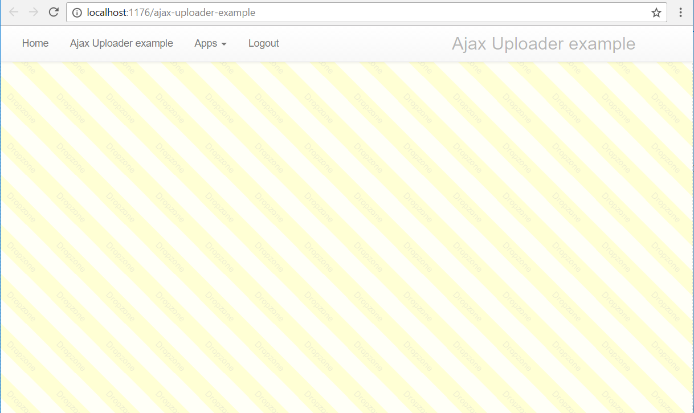

Drag and drop Ajax uploader
========

This folder contains the Ajax uploader widget of Phosphorus Five. The uploader widget, allows the user to drag and drop files
unto the surface of some part of his page, for then to automatically upload these files to the server. The user can also click the uploader
to have a "browse for file(s) dialogue" open up.

Below is an example of how to use it.

```
create-widget:foo
  parent:content
  class:col-xs-12
  widgets
    sys42.widgets.uploader
      .onupload

        // Sleeping the current thread, just 
        // to make sure user can see animation.
        sleep:5000
        sys42.windows.info-tip:File '{0}' uploaded
          :x:/../*/_filename?value
```

The above would produce something like the following, when files are dragged and dropped unto its surface, or selected by clicking the widget.


When a file is dropped unto the above uploader or dropzone, then a nice animation will give visual clues to the user, that the file is in the
process of being uploaded.

The uploader has the following arguments.

* [_css-file] - A CSS file to include when widget is displayed. Defaults to "uploader.min.css".
* [_filter] - Filter for file types to accept.
* [_allow-multiple] - If true, multiple files can be uploaded at the same time.
* [_class] - Default CSS class to use. Defaults to "uploader-widget".
* [_dragover-class] - CSS class to add when files are dragged unto the surface of the uploader. Defaults to "uploader-widget-dragover".
* [_drop-class] - CSS class to use when a file is dropped in the widget. Defaults to "uploader-widget-drop".
* [.onupload] - Lambda callback to invoke when a file has been uploaded.

The default CSS file, contains some configuration classes, which allows you to control the positioning of your uploader widget. These are listed below.

* "uploader-footer" - Makes sure the uploader is absolutely positioned at the bottom of your screen, in a fixed position.
* "uploader-faded" - Makes your widget semi-transparent, to not be so prominent on your form.
* "uploader-large" - Makes your widget become 300px tall.
* "uploader-small" - Makes your widget becomes smaller, 60px tall.
* "uploader-full-screen" - Makes your widget fill the entire screen, though behind your other widgets.
* "uploader-fill-container" - Makes your widget fill the container of whatever widget it is container within.

If you use "uploader-full-screen" and "uploader-faded", in addition to of course, the default CSS class of "uploader-widget", then your uploader
will look like the following.



In the above screenshot, which has a *[_class]* of _"uploader-widget uploader-full-screen uploader-faded"_, your entire page will become a dropzone.

## Receiving your files on your server

Your *[.onupload]* lambda callback, will be invoked with the following arguments.

* [_count] - Total number of files in current upload.
* [_current] - Current file number [0 .. _count>
* [_filename] - Filename as supplied by client.
* [_content] - Content of file.

Below is an example of how to create a fullscreen uploader, that saves one or more files, to the currently logged in 
user's documents/private folder.

```
create-widget:foo
  parent:cnt
  widgets
    sys42.widgets.uploader
      _class:uploader-widget uploader-full-screen uploader-faded
      _filter:jpg|jpeg|gif|png
      .onupload

        // Saving file, and notifying user of success.
        save-file:~/documents/private/{0}
          :x:/../*/_filename?value
          src:x:/../*/_content?value
        sys42.windows.info-tip:File '{0}' was uploaded and saved
          :x:/../*/_filename?value
```

Notice, the *[_filter]* above, restricts the filetypes to image types of either .png, .jpeg, .jpg or .gif. If 
you try to drag and drop files of types not supported by the above uploader unto its surface, it will refuse
to upload them, and show a "red warning" CSS class to the user.

Notice also, that from a semantic point of view, if you use the _"uploader-full-screen"_ class, it is probably
better if you append the uploader widget directly into the _"cnt"_ parent container.

## Ninja tricks

Below is a small application that uses the Ajax uploader dropzone widget, and the Ajax DataGrid, to create a dropbox for your personal files.

```
create-widget:ajax-dropbox
  parent:content
  widgets


    // Ajax uploader widget
    sys42.widgets.uploader:uploader
      .onupload

        // Saving file, and notifying user of success.
        save-file:~/documents/private/{0}
          :x:/../*/_filename?value
          src:x:/../*/_content?value
        sys42.windows.info-tip:File '{0}' was uploaded and saved
          :x:/../*/_filename?value
        sys42.widgets.datagrid.databind:datagrid

    void
      element:hr

    // Datagrid
    sys42.widgets.datagrid:datagrid
      _on-get-items
        list-files:~/documents/private/
          filter:x:/../*/_query?value
        for-each:x:/-/*?name
          split:x:/@_dp?value
            =:/
          add:x:/./*/add/[1,]/*/*
            src:"file:{0}"
              :x:/@split/0/-?name
          eval-x:x:/+/*/*
          add:x:/../*/return/*/_items
            src
              file:x:/@_dp?value
        return
          _items
      _on-select-items
        sys42.cms.download-file:x:/../*/_items/*?name


```

The above piece of Hyperlambda, will result in something resembling this.


