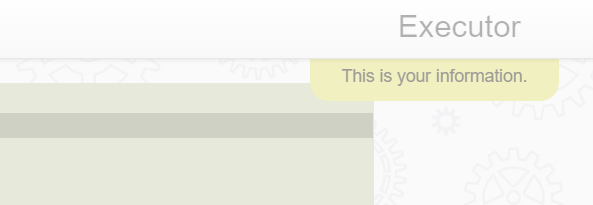

A small information Ajax dropdown Window
========

This folder creates a small information tip window, displaying some simple text, or HTML, to the user for a handful of seconds,
before it is automatically faded away. An example of usage can be seen below.

```
sys42.windows.info-tip:This is your information.
```

Notice, you can only create one instance of this window for each Ajax request you create towards your server. Below is a screenshot of how
it might look like, depending upon the CSS you use to display it.



Arguments;

* [_arg] - The text or HTML to display.
* [class] - CSS class to display your window with. Defaults to "info-window".
* [parent] - Which parent to inject your window into. Defaults to "cnt".

To display an error text, which is shown for a longer period, you can do something like the following.

```
sys42.windows.info-tip:This is your information.
  class:info-window info-window-error info-window-longer
```
