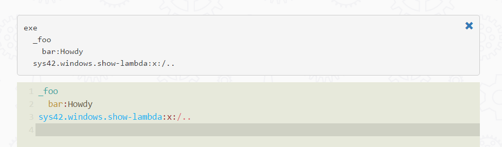

Showing the current Hyperlambda
========

This folder creates a small debug helper window, that displays the currently evaluated Hyperlambda stack, or parts of it it you wish. Example of usage
can be found below.

```
_foo
  bar:Howdy
sys42.windows.show-lambda:x:/..
```

The above would look like the following.



Arguments;

* [_arg] - And expression leading to whatever lambda you want to see.
* [_class] - CSS class to display your window with. Defaults to "col-xs-12 show-code-window".
* [_parent] - Which parent to inject your window into. Defaults to "content".

To see only parts of your stack, you can pass in an expression, leading to the part you wish to see. Example below.

```
_foo
  bar:Howdy
sys42.windows.show-lambda:x:/../*/_foo
```

Due to the nature of Hyperlambda, being an input/output language, changing as you execute parts of it, this window is actually highly
useful, for watching parts of your code, at the point you invoke your window. If you don't know what a piece of code looks like, at some
specific point in your execution, then this is easy to see, by invoking the show-lambda window, at the point in your code, where
you wish to inspect the code, and its data.

You can create multiple windows of this type, during one request. The last window you create, will be shown above the previous window you created.
