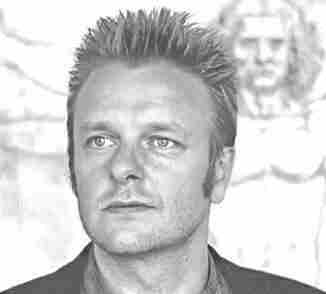

Image manipulation
===============

This folder contains Active Events that allows you to manipulate images in Phosphorus Five. Currently there are two Active Events in this plugin.

* [p5.imaging.get-size] - Returns the size of an image on your server.
* [p5.imaging.resize] - Resize an image on your server.

## Retrieving an image's size

To retrieve the size of an image, you can use the following code.

```
p5.imaging.get-size:~/thomas.jpg
```

The above code assumes you've got an image in your main home folder called _"thomas.jpg"_, and it will return something resembling the following.

```
p5.imaging.get-size
  /users/root/thomas.jpg
    width:int:326
    height:int:294
```

You can supply an expression leading to multiple paths, to retrieve the size of multiple images at once, if you wish.

## Resizing and clipping your images

To change the size of an image, requires some explanation before we dive into it. The Active Event you use to change an image's size, is 
called *[p5.imaging.resize]*. This Active Event takes the following arguments.

* [width] - New width of image
* [height] - New height of image
* [dest] - Destination for the resized image
* [src-rect] - An optional rectangle declaring where to clip your source image, to create the destination image

The *[src-rect]* argument, takes the following children.

* [top]
* [height]
* [left]
* [width]

If you supply a *[src-rect]*, then the source image, will be clipped according to your *[src-rect]* argument, before it is resized to your *[width]* 
and *[height]*, and stored to your *[dest]* filename. This allows you to clip the image, as you are resizing it. Consider the following, assuming you've
got our first _"thomas.jpg"_ example image, from our first example, and that your image is at least 300x200 in size.

```
p5.imaging.resize:~/thomas.jpg
  dest:~/new.jpg
  width:500
  height:100
  src-rect
    top:0
    height:200
    left:0
    width:300
```

The above code, will first of all cut your image, from the top left corner, removing all but the first 200x300 pixels. Then it will stretch that result,
into your destination, making it become 500x100 pixels in size. The result will probably look _"weird"_, and highly skewed, depending upon your source image.

Your *[src-rect]* must be within the boundaries of the size of your source image.

Notice!
If your destination image already exist, it will be silently overwritten.

The *[p5.imaging.resize]* Active Event can take expressions, but only one image can be resized at the same time. If you do not supply a *[src-rect]*, the
entire image will be resized, and the *[src-rect]* will default to encompass your entire source image. Consider the following.

```
p5.imaging.resize:~/thomas.jpg
  dest:~/new.jpg
  width:500
  height:100
```

The above code, will not in any ways _"clip"_ your image, but keep the entire source image, only resizing it.

### Converting an image

If you wish, you can use the *[p5.imaging.resize]* Active Event to convert between image types, without resizing your image. In such a case, you only
need to supply a *[dest]* argument, and not pass in any *[width]* or *[height]*, at which case, the height and width of your new image, will be the
same as your source image. Consider this.

```
p5.imaging.resize:~/thomas.jpg
  dest:~/thomas.png
```

Notice above, that the only difference in the source and the destination, is the file extension that is being changed from _".jpg"_ to _".png"_. This will 
result in the exact same image, but with a different image format. 

### Changing the quality of your image

If your destination image is of type JPG, meaning its file extension is either _".jpg"_ or _".jpeg"_, you can change the quality of your destination image, 
by providing a *[quality]* argument. This argument must have a value between 0 and 100, where 100 is best quality, and 0 is worst quality. For instance, to
aggressively reduce the quality, and hence the size of your image, you could do something like the following. 

```
p5.imaging.resize:~/thomas.jpg
  dest:~/thomas-compact.jpg
  quality:5
```

The above level for your *[quality]* argument will significantly reduce the quality of your image. A better value, yet still an agressive value, would probably
be somewhere between 15 and 25, depending upon your source image.

To understand the difference, realize that this image.


Was reduced from 13 KB on disc, to 3 KB after reducing its quality with a value of "5". However, the result becamse pretty bad, as you can see below. A value
of 20 however, still reduces the image size significantly, to 6KB, while still retaining a relatively hig quality for your image.


A value of 20 however, still reduces the image size significantly, to 6KB, while still retaining a relatively "OK" quality for your image.



Notice, sometimes, depending upon how your image looks like, you can also drastically reduce your image size, by going from JPG to PNG for instance, 
if your image contains a lot of the same colors, and big surfaces. The opposite is true if your image contains a log of different colors, with 
more _"organic"_ content.

The above image of your truly for instance, is probably much better to display as a JPG image. If it had lots of big surfaces, with similar colors though, 
it would probably be more compact as a PNG image.
